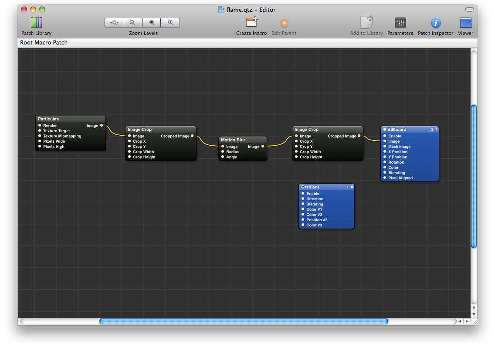
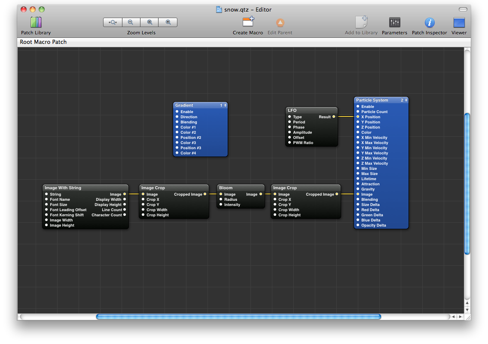

After creating a [series of compositions]({filename}/2010/sharp-scan-lines-squared-lava-lamp.md) based on my [kaleidoscopic patch]({filename}/2010/kaleidoscope-001-002.md), I played with Quartz Composer's particle system, to create a flame and falling snow flakes:

https://www.youtube.com/watch?v=wsYLevXRytA

https://www.youtube.com/watch?v=0FH_-_chcfY

As for the last times, both [Flame]({attach}flame.qtz) and [Snow]({attach}snow.qtz) source compositions are available. Flame's patch looks like this:

And here is Snow's patch preview:

