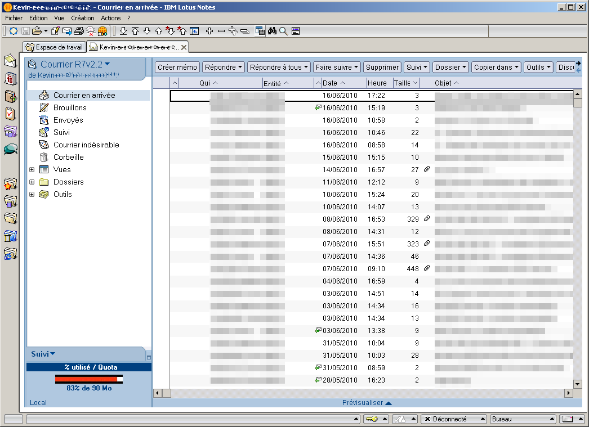
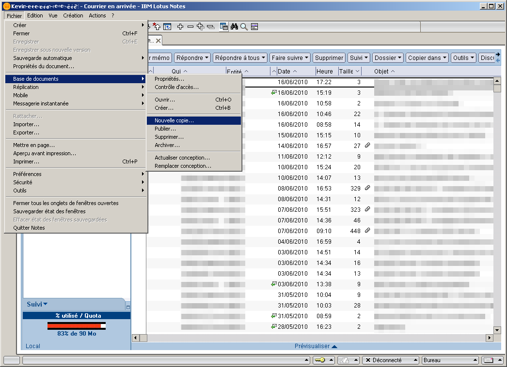
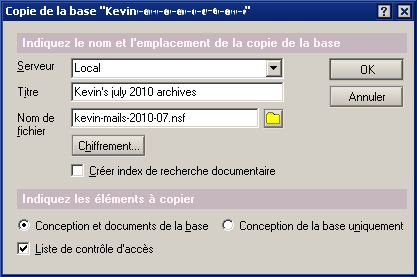
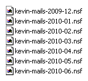

You are using Lotus Notes as your mail platform. Unfortunately your mailbox has a quota you've already reached and you need space. A solution consist in exporting regularly your mails on your local machine to free up your inbox. Here is a little article documenting the export procedure using the fat desktop client.

If screenshots were taken with a french version, instructions given here are for the english one. This will give you enough clues to perform the export whatever the localisation is. The Lotus Notes version I used was the 7.0.2 release.

So first, let's start Notes and open your mailbox. You should be on a screen similar to this one:

Then, go to the `File` › `Database` › `New Copy` menu:

And you'll get an export screen that'll let you choose where to create a local copy of your database:

This will generate a `.nsf` file containing all your current mail.

Now that you have a backup, you are free to delete all your mails in Lotus Notes. By following this procedure regularly, you can create yearly or monthly archives of you mails without reaching the mailbox quota! For example, this is how my local archive folder looks like:

