After 2 years using an iPhone 3G, it's time for me to [switch to
the Android world](https://twitter.com/kdeldycke/status/24219289221). [My Apple
era is over](https://twitter.com/kdeldycke/status/22007247873), I need a
plateform that is more Linux and open-source friendly.

Before erasing and [selling my iPhone
](https://twitter.com/kdeldycke/status/24687160120), I want to backup and
extract all the data I produced with it and that is still trapped inside. This
mean photos, SMSs, voice messages, safari bookmarks, etc...

There is a nice OS X app simply called [iPhone Backup Extractor
](https://supercrazyawesome.com) which let you get these data. Instead of
getting data directly from the iPhone, it reads its backups made by iTunes.

So first thing you have to do is to backup your phone using iTunes:

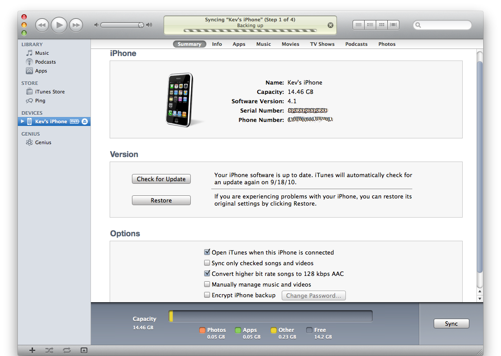

Then you can download and run the iPhone Backup Extractor app:

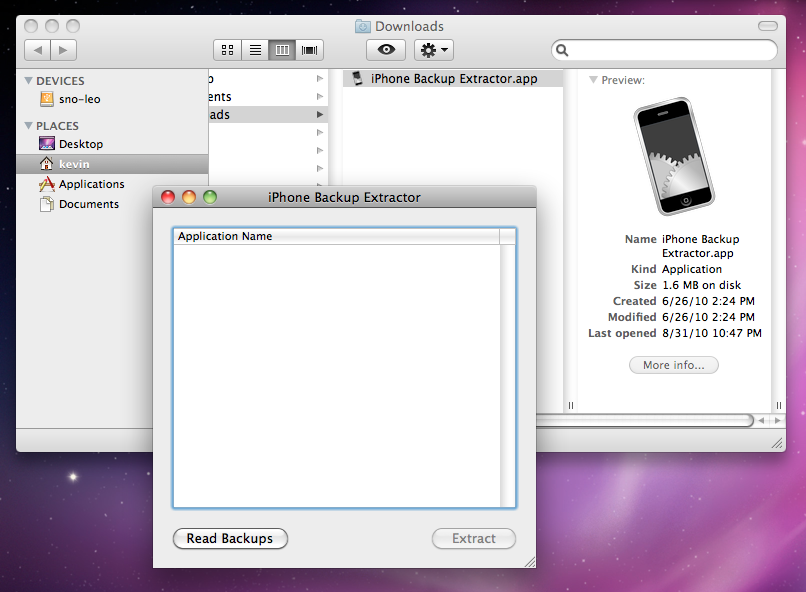

Here you just have to click the _Read Backups_ button to get a list of all
backups available on your machine. Then choose your latest backup:

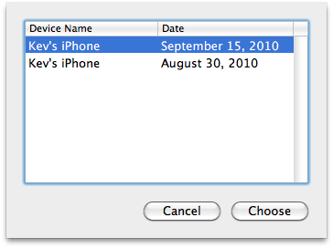

You'll get a list of all installed applications on your iPhone. As we are
interested in "core" iPhone apps (SMSs, photos and so on), we'll choose the
"iOS Files" item, then choose a place where to extract:

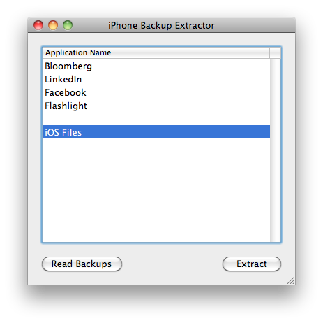

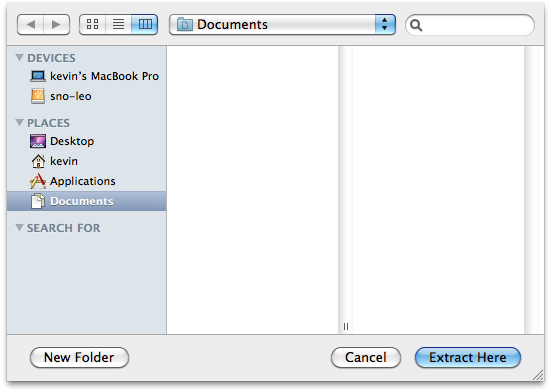

Then the extraction itself will take place:

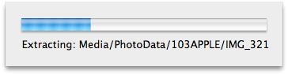

You've just finished the essential part of the process. You now have a nice
folder structure containing all the important information that was trapped in
your phone:

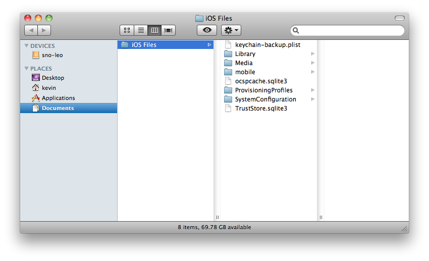

Let's browse the file structure that was just created. You can see photos are
available as is, in the `/iOS Files/Media/DCIM/XXXAPPLE/`:

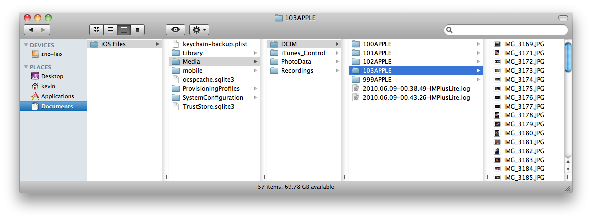

Most of other data are located in the `/iOS Files/Library/` folder. For
example here are voice messages:

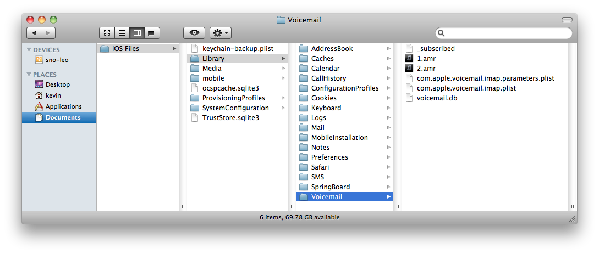

Again, `.amr` files here are playable as-is, like [VLC
](https://www.videolan.org/vlc/) or [mplayer](https://www.mplayerhq.hu).

Most, if not all, other kind of data and metadata are stored in SQLite
databases (`.db` files). The best GUI I found to manipulate with these files
under Mac OS X is [SQLite Database Browser
](https://sourceforge.net/projects/sqlitebrowser/). See how I can easily extract
to a CSV file all metadatas associated with my voice messages:

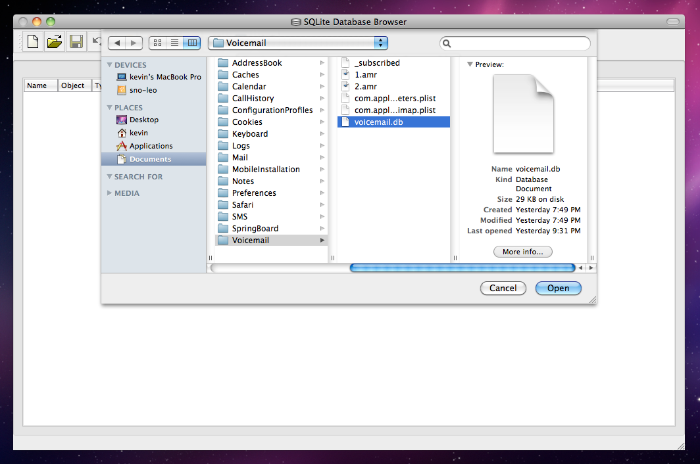

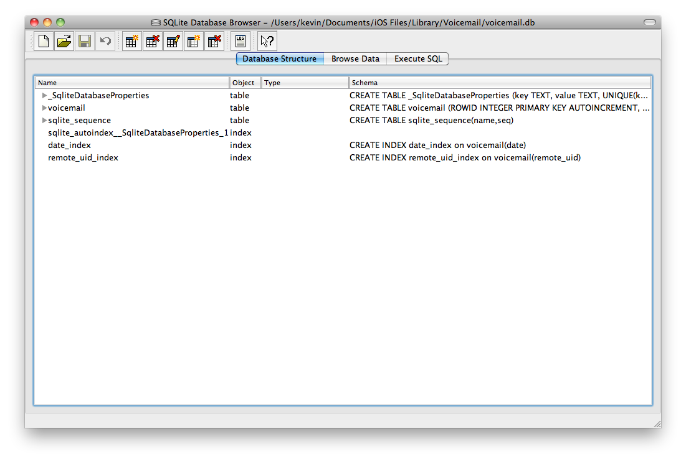

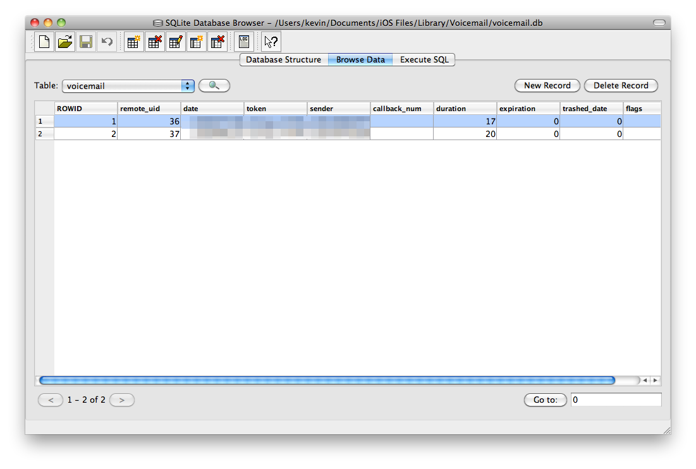

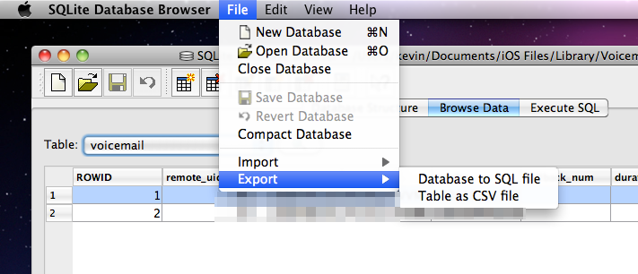

Finally, just in case you want to extract iPhones data from another backup than
the default backup, like from a backup of the backup (isn't that clear?),
making a symlink is enough to trick iPhone Backup Extractor:

```shell-session
sh-3.2# pwd
/Users/kevin/Library/Application Support/MobileSync
sh-3.2# mv ./Backup ./Backup-copy
sh-3.2# ln -s "/Volumes/Untitled 1/laptop-kev-osx/mirror/Users/kevin/Library/Application Support/MobileSync/Backup" .
sh-3.2# ls -lah
total 8
drwxr-xr-x   4 kevin  staff   136B Sep 16 21:56 .
drwx------+ 11 kevin  staff   374B Sep 15 19:29 ..
lrwxr-xr-x   1 root   staff    99B Sep 16 21:56 Backup -> /Volumes/Untitled 1/laptop-kev-osx/mirror/Users/kevin/Library/Application Support/MobileSync/Backup
drwxr-xr-x   4 kevin  staff   136B Aug 30 13:20 Backup-copy
sh-3.2#
```

That's how I was able to extract my iPhone data from an old backup, and get
back most of the [data I lost after my last iOS update
](https://twitter.com/kdeldycke/status/22516008513):

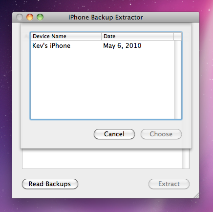
