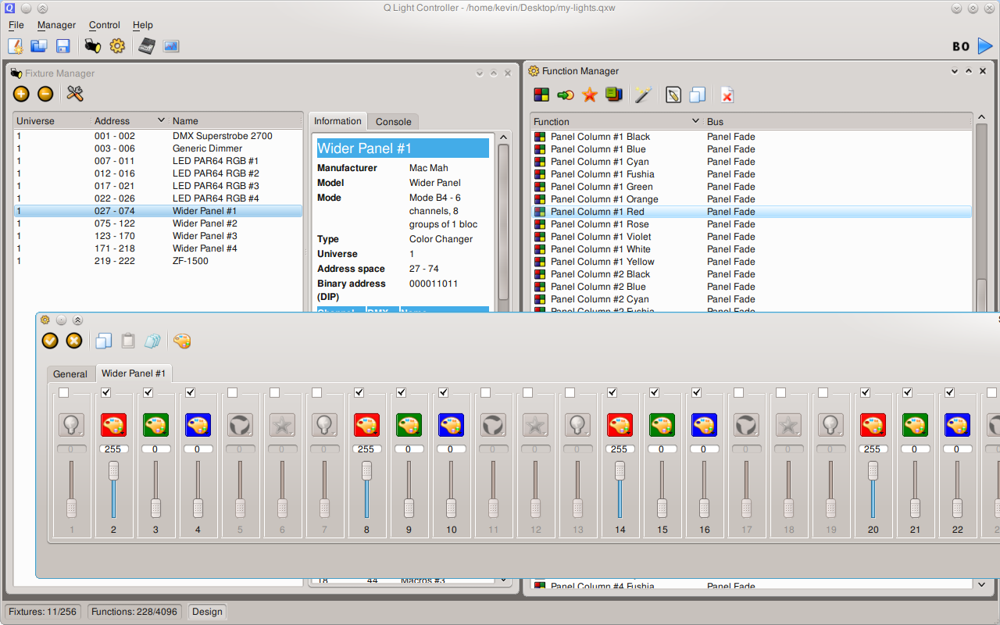
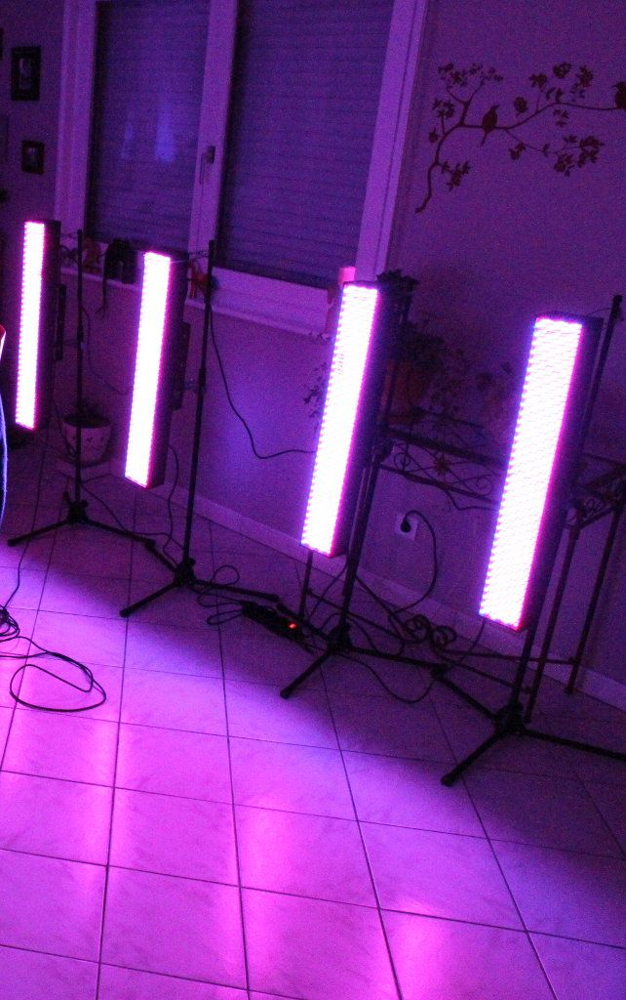
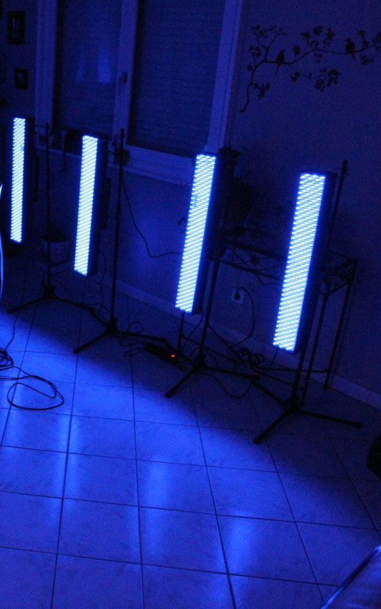
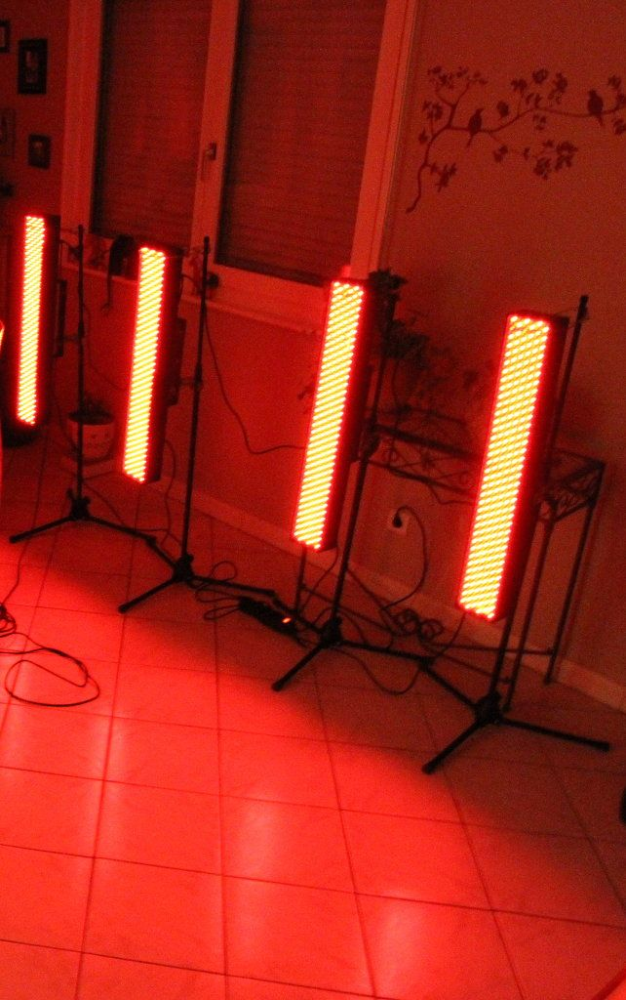
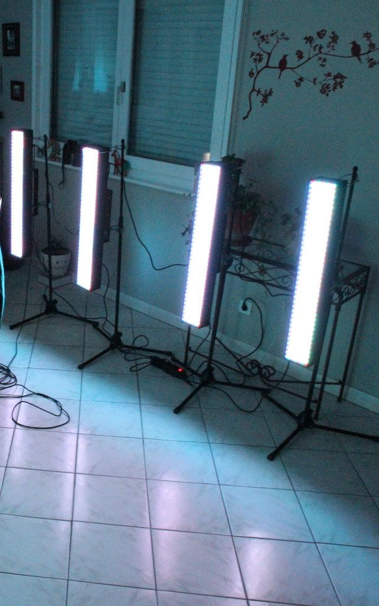
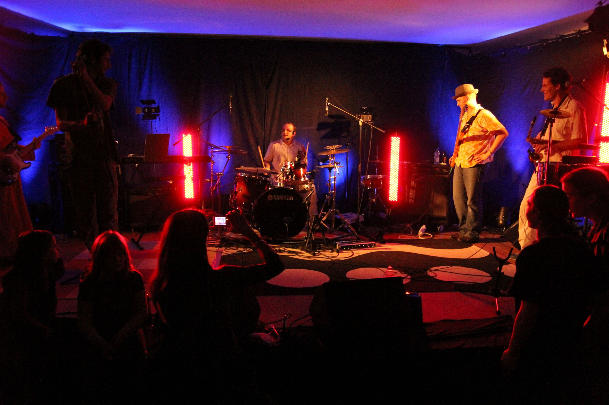
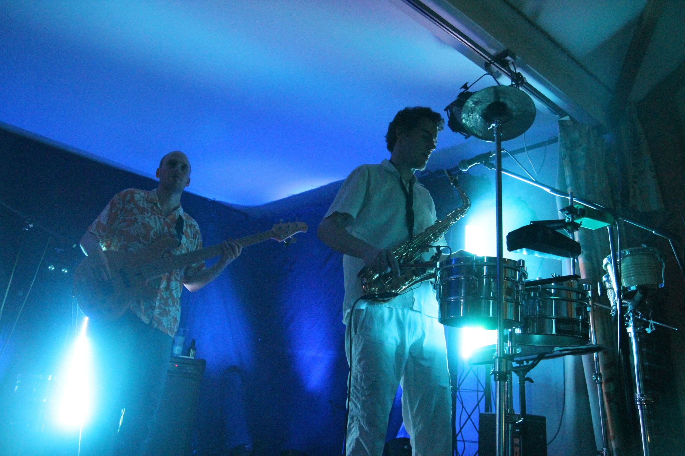
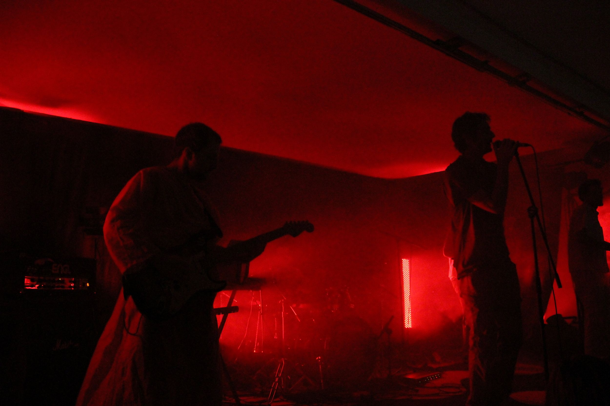

Here is another script I wrote some months ago. It's called
[`qlc-effects-generator.py`](https://github.com/kdeldycke/scripts/blob/master/qlc-effects-generator.py).
It's a quick and dirty hack that generate chasers, groups and scenes for
[QLC (a QT-based DMX lighting software)](https://sourceforge.net/projects/qlc/).
It just produce XML statements you copy'n'paste in your `.qxw` QLC workspace
file.

I used it to create some effects for my 4 el-cheapo
[Mac-Mah LED wider panels](https://fr.audiofanzine.com/projecteur-traditionnel-divers/mac-mah/WIDER-PANEL-RGB-648-LEDS-DMX/).
This script helped me generate column and row presets of my 4x8 pixels LED
matrix for some basic colors:

Here are some photos of my preliminary tests at home:

And finally photos of the panels on stage (
[taken by Toma Heroow](https://web.archive.org/web/20100605092334/https://www.heroow.fr/2009/11/18/cool-cavemen/)
during
[Cool Cavemen's concert in last november](https://coolcavemen.com/2009/mametzik-mad-fest-chez-march/)):

As usual, use and hack this script at you own risks, and feel free to send me
bug reports and contributions! :)
