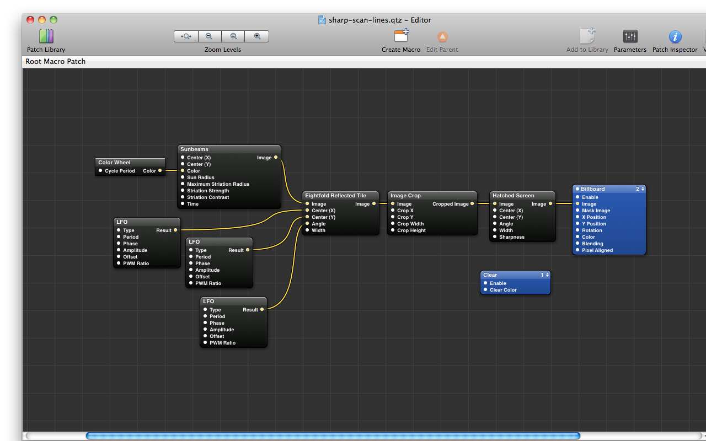
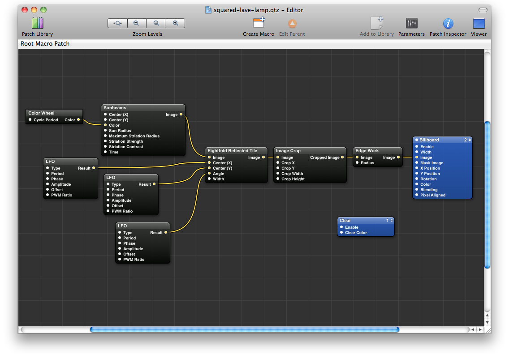

Here are 2 new Quartz Composer compositions. Both of them are based on the same [kaleidoscope patch]({filename}/2010/kaleidoscope-001-002.md) from my last post, but are processed before the final rendering. This gives some interesting visual effects that are quite distant to the original kaleidoscopes.

https://www.youtube.com/watch?v=axz4A2KRmzc

As usual, [sources of this _Sharp scan-lines_ composition]({attach}sharp-scan-lines.qtz) are provided. And for information, its patch looks like this:

https://www.youtube.com/watch?v=b8BuwhgaG-8

Again, you can [download the _Squared lava-lamp_ source]({attach}squared-lava-lamp.qtz), and here is preview of its patch:

