Here is a collection of all themes I created for the
[Cool Cavemen website](https://coolcavemen.com) over the years.

Before settling on its current name, the Cool Cavemen project was referred to by
its members as _The Ultimate Band_ (talk about rock-star egos...). Here is a
screenshot of the theme I did for e107:

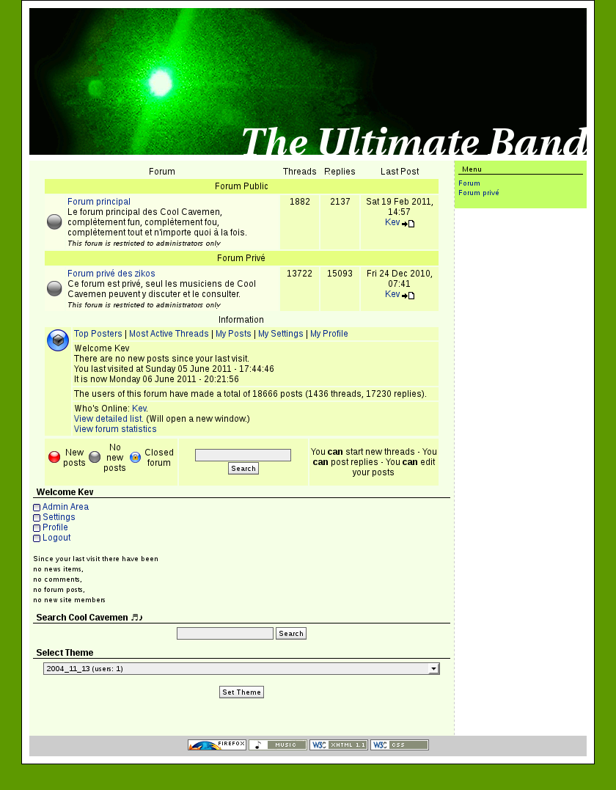

In fact the
[original HTML mockup](https://web.archive.org/web/20120429001808/https://coolcavemen.com/2004_11_01-first-cavemen/index.html) this theme is based on still exists. It is dated back to November 1st, 2004, which is now the official [Cool Cavemen anniversary](https://coolcavemen.com/2005/joyeux-anniversaire-cool-cavemen-bientot-le-premier-cd/).
The theme above was created two weeks later.

When I created the Cool Cavemen's site, I choose e107. Back then I perceived it
to be the only Open Source PHP-based CMS having the best balance between a clean
and a powerful theme engine. That was my opinion before decided to
[switch to WordPress]({filename}/2006/e107-to-wordpress-migration-here-is-why.md).

At the end of November '04, our theme was updated to this:

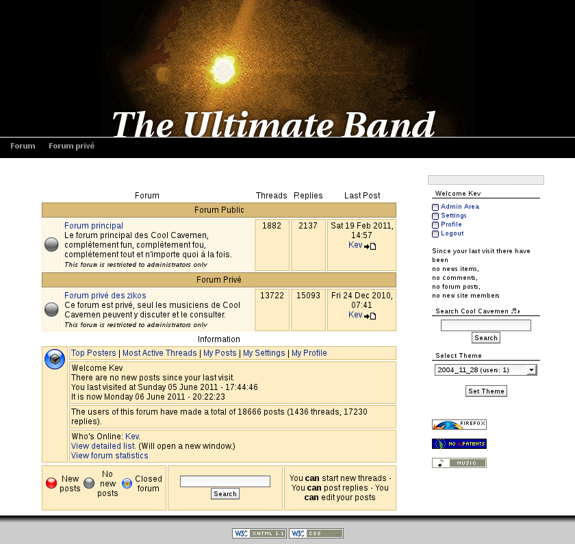

The header above is based on a photo of a green laser, that was taken by
[Cool Cavemen's guitarist](https://coolcavemen.com/biography/steve-canett/).

2005 started with an updated version of the theme, featuring a photo of Cool
Cavemen's first gig. They were only three on stage,
[our bass player](https://coolcavemen.com/biography/guiguit/) was still drumming
at the time:

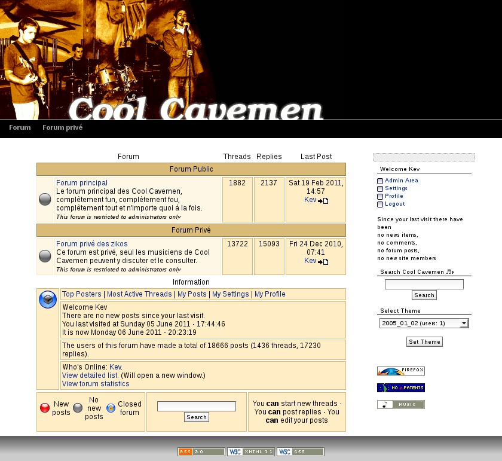

In February we finally had our official photo featuring all members of the band!
But it was cold outside so we added some fur to keep our website warm:

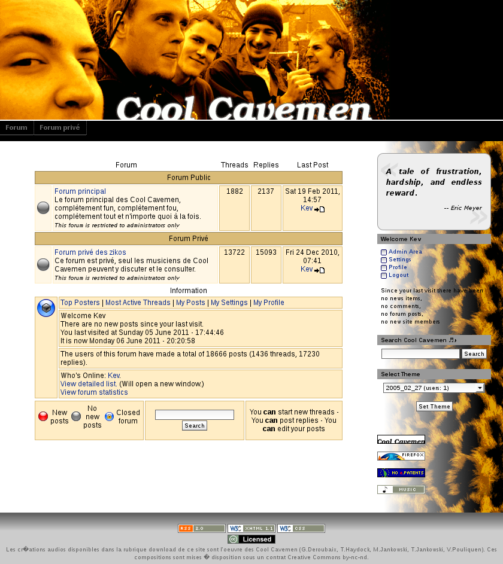

I spent the next months trying to build my own version of
[the Holy Grail](https://www.alistapart.com/articles/holygrail/): a perfect
CSS-based 3-columns fluid layout (with a middle column placed in the top of the
HTML). This explain [Eric Mayer](https://en.wikipedia.org/wiki/Eric_Meyer)'s
quote in these mockups and the references to the
[Skidoo Too template](https://ruthsarian.wordpress.com/2004/08/20/stgargoyles/):

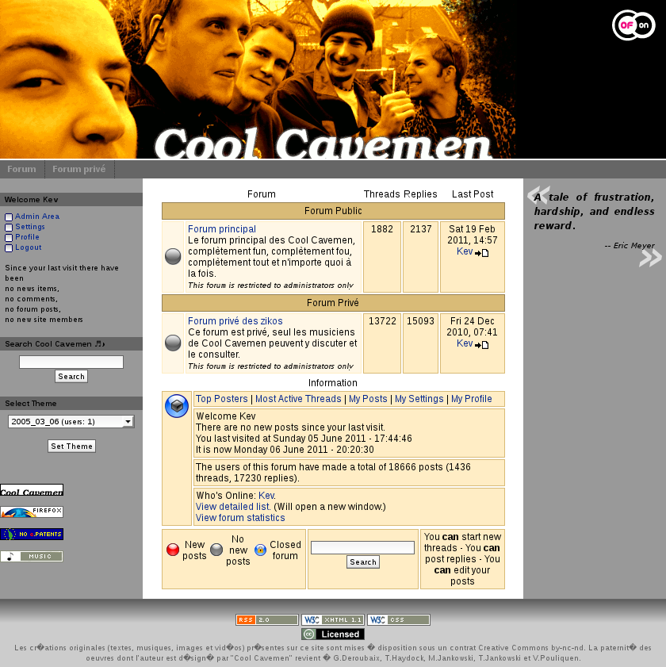

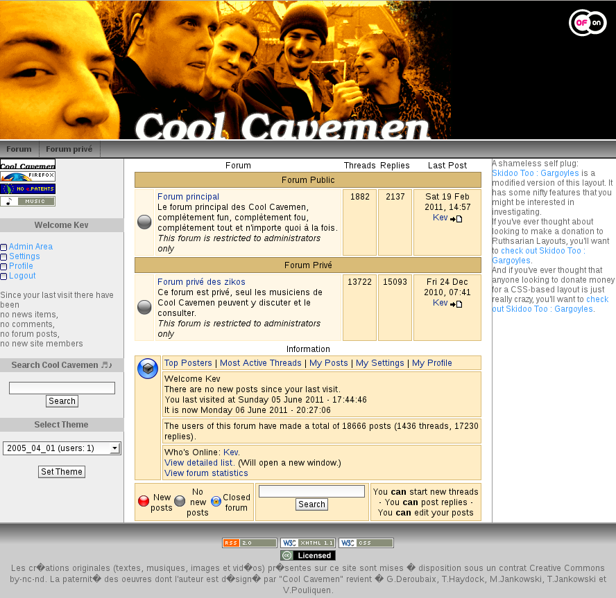

I never found the Holy Grail, and the tests above remained unseen by the public.
Tired by this journey, I never touched the theme again.

Until September 2005 when I updated it to this:

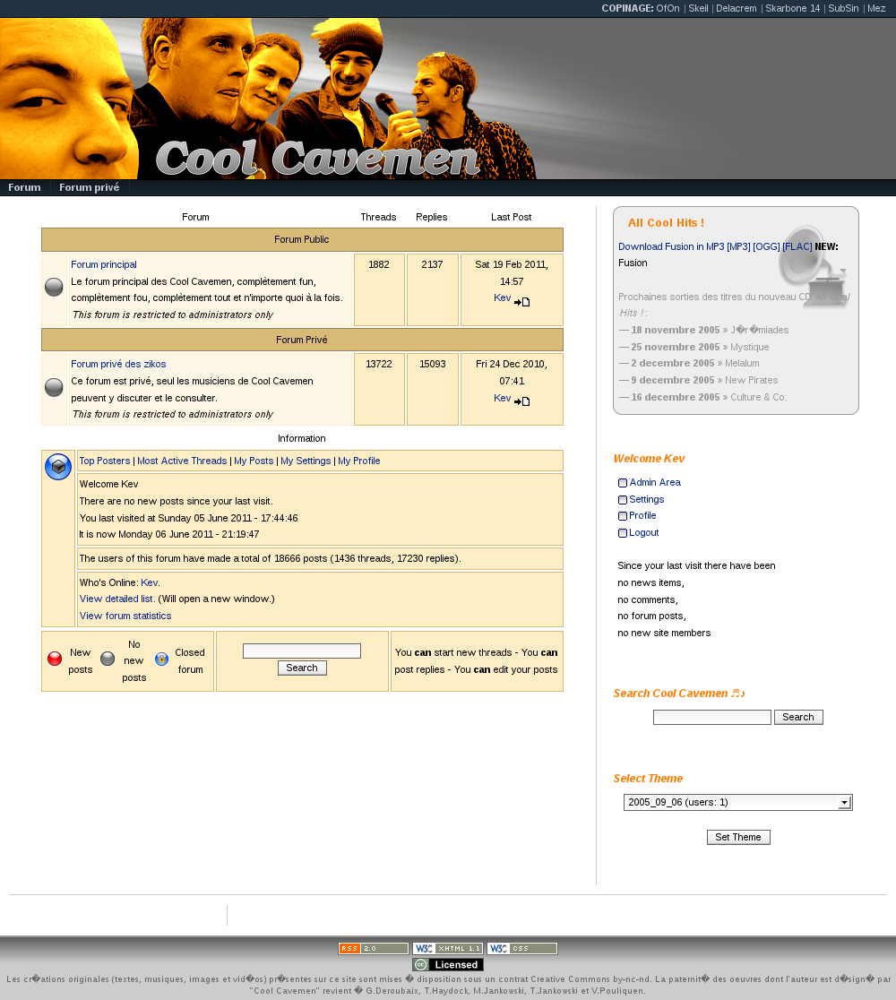

Notice the box in the top of the right column, which was designed to publish a
new track every week. The
[code behind this box]({filename}/2007/delayed-cd-tracks-publishing-with-php.md)
is available in another article.

So that was the last major version of the theme. Basically our e107 site looked
that way for most of its life.

In November 2005 I attempted to reboot the theme. I made these 3 propositions to
the band:

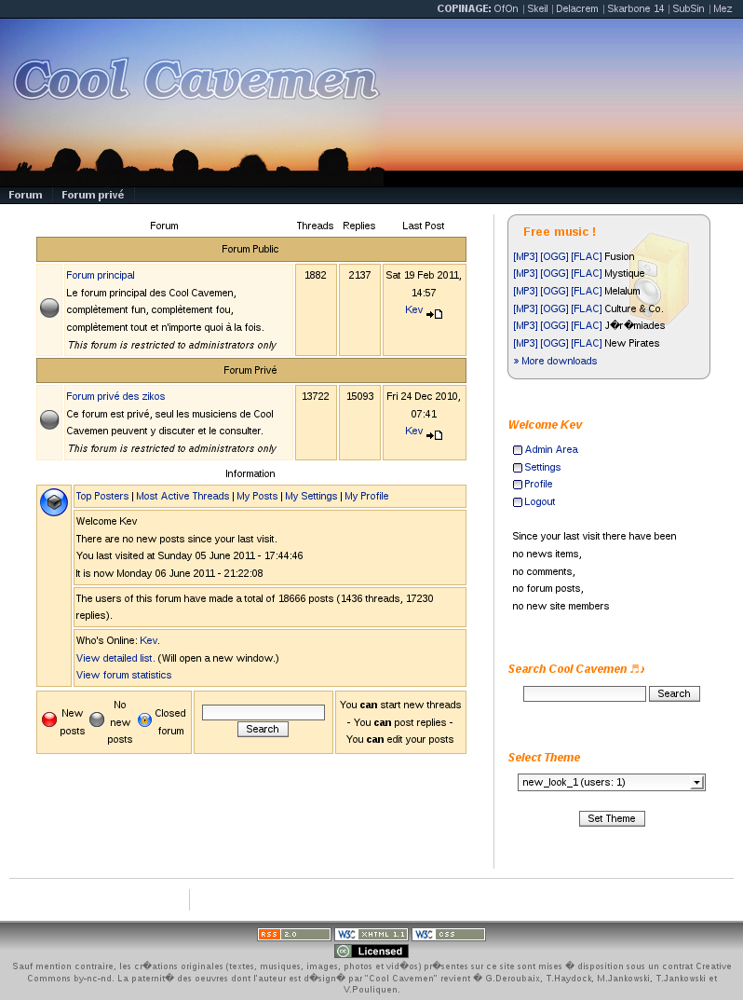

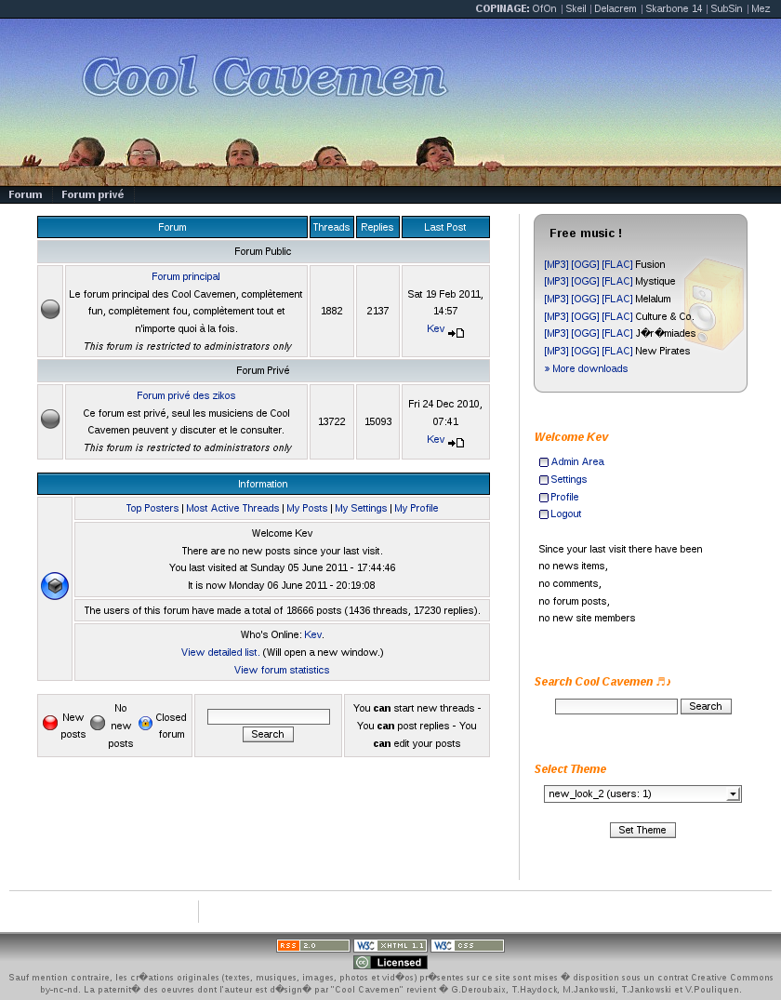

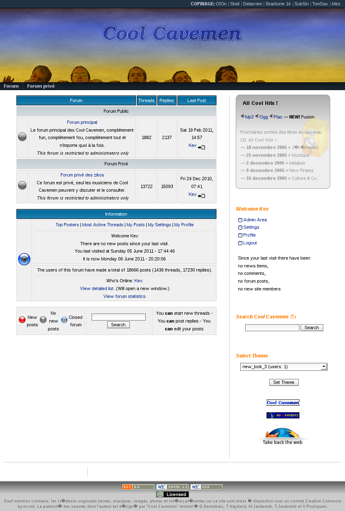

The last one had an interactive header, with tiny sketches showing up on mouse
over:

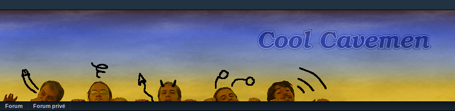

Unfortunately we didn't found any of these themes matching the Cool Cavemen
spirit (whatever that is). If these
[alternatives were publicly discussed](https://coolcavemen.com/forums/topic/nouveaux-look-du-site/),
we decided that no one was going to replace our previous theme.

The final update we made was when our
[Raw EP](https://coolcavemen.com/discography/raw/) was released. We basically
applied filters on the header to match Raw's cover. We also updated our logo to
use the one designed for us by [QPX](https://wqpx.wordpress.com/):

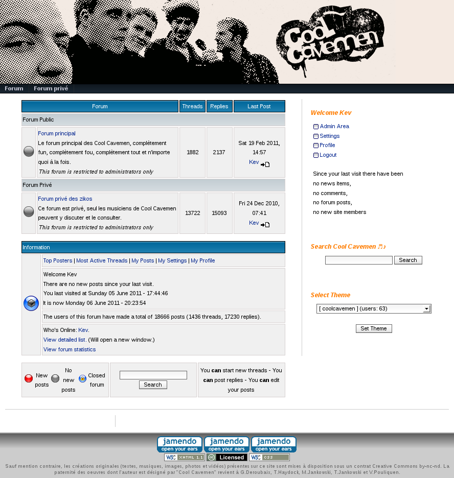

Then I switched to WordPress:

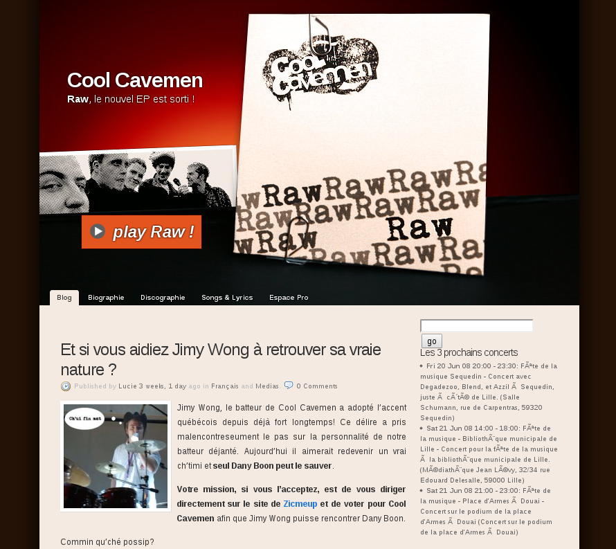

The new theme was based on
[K2](https://web.archive.org/web/20150107112837/https://getk2.com/about/), on
which I added a
[corner banner]({filename}/2008/how-to-add-a-corner-banners-to-a-k2-wordpress-theme-style.md)
while it was on beta.
