_4m²_, the first narrative short film I work on, was just made [available on YouTube](https://www.youtube.com/watch?v=91y6L3QKiRk). I wasn't expecting a public release that fast (and this makes a really pleasant surprise), so I had no time to prepare a more detailed article. I'll try to write one soon, but in the mean time, enjoy the final result of a great teamwork:

https://www.youtube.com/watch?v=91y6L3QKiRk

And here are the official stills of the short:

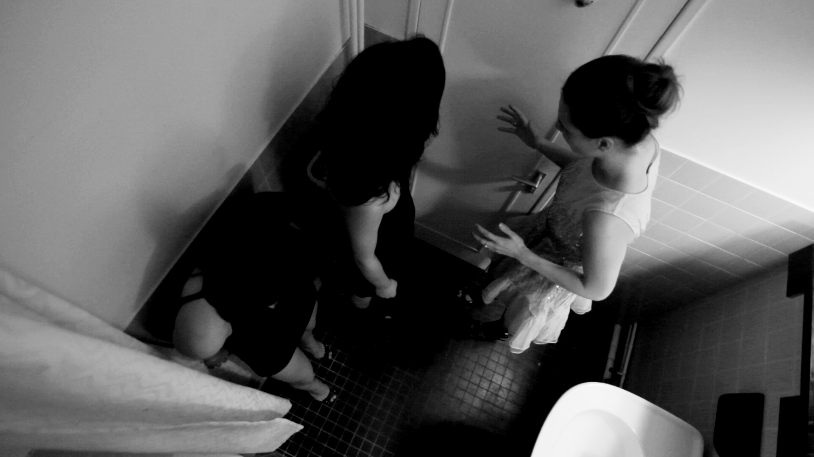

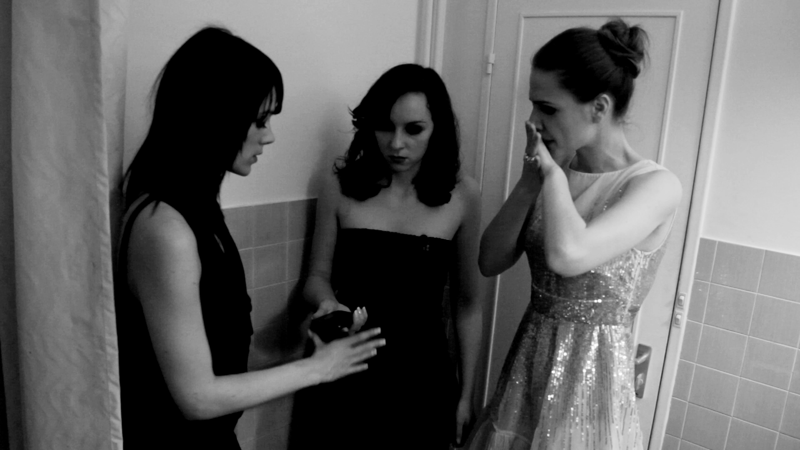

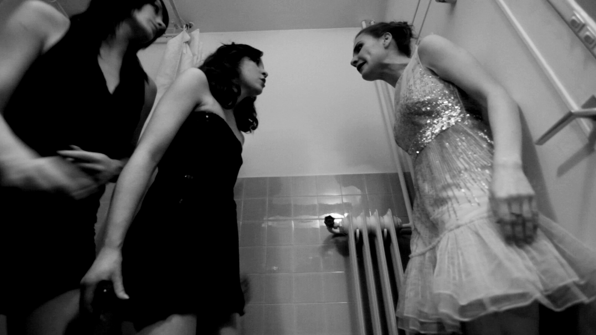

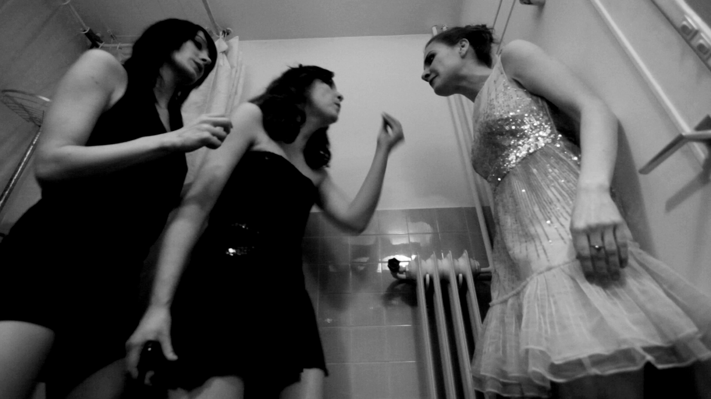

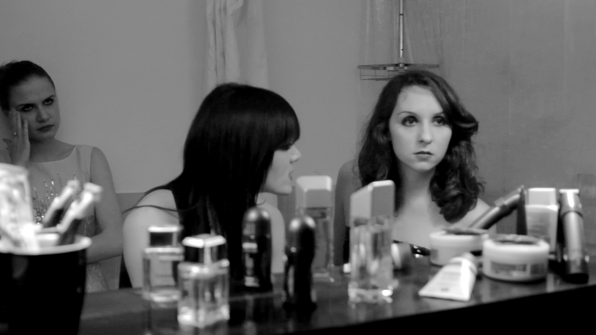

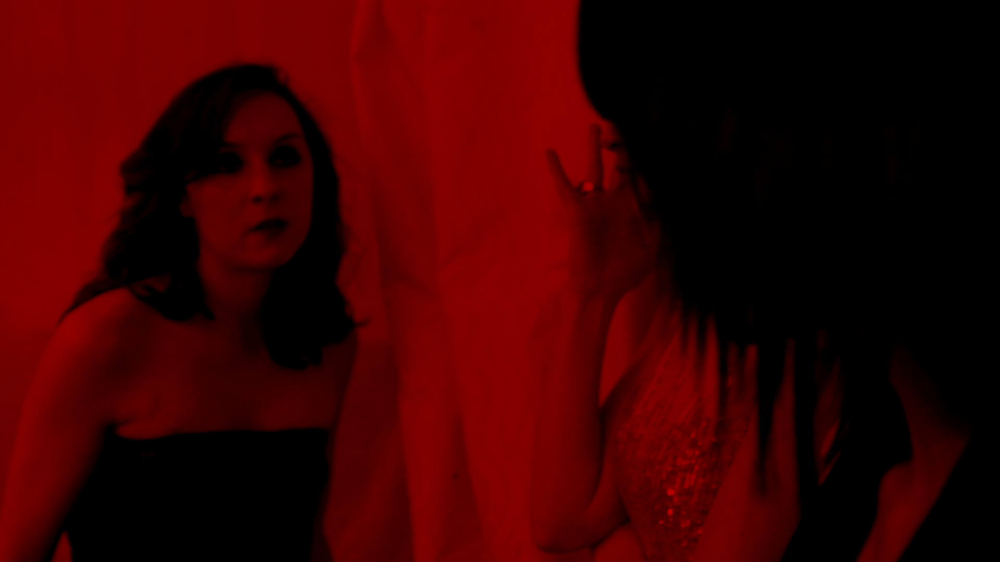

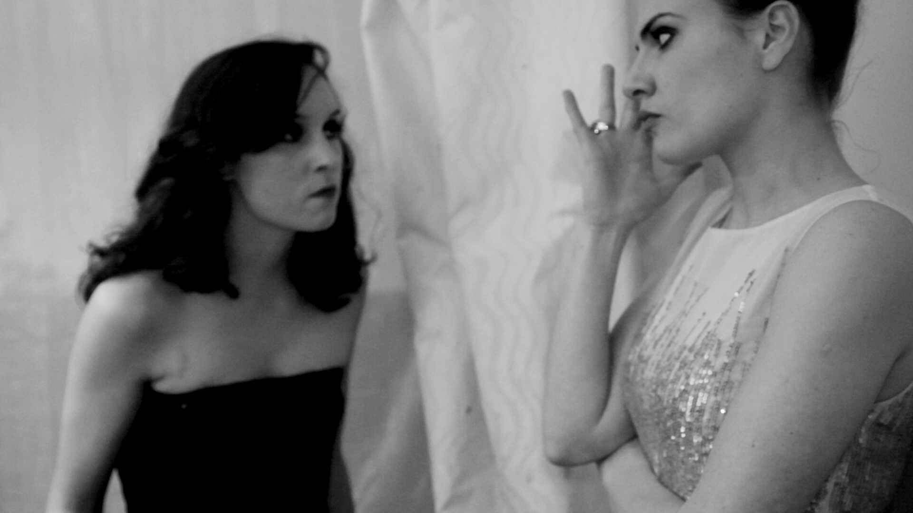

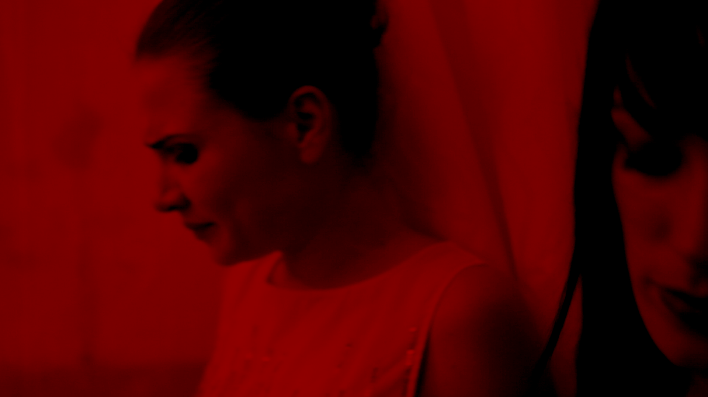

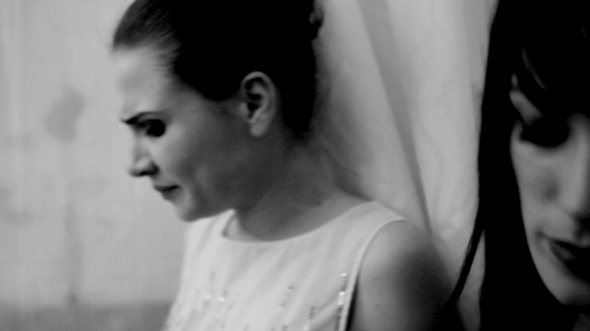

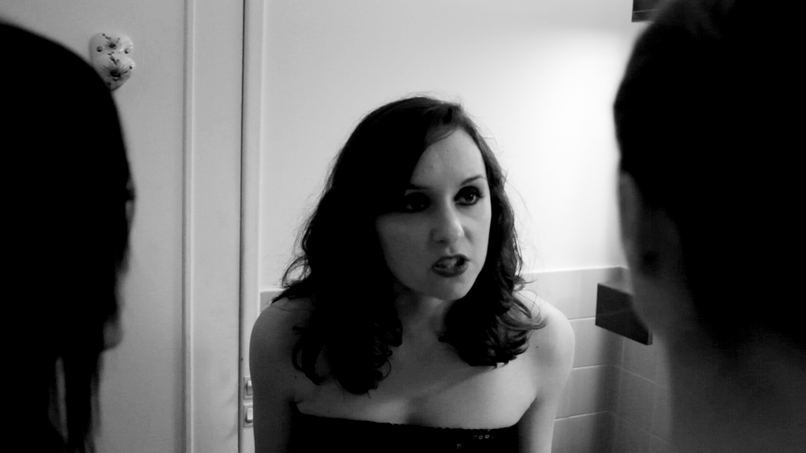

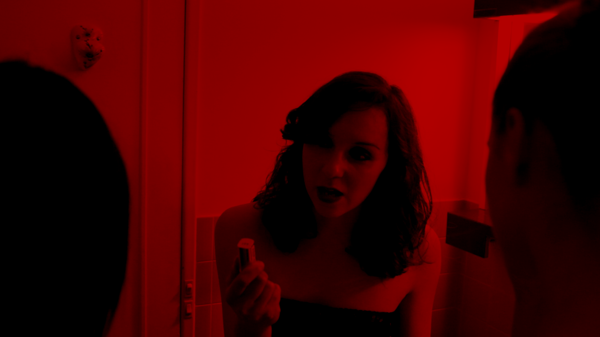

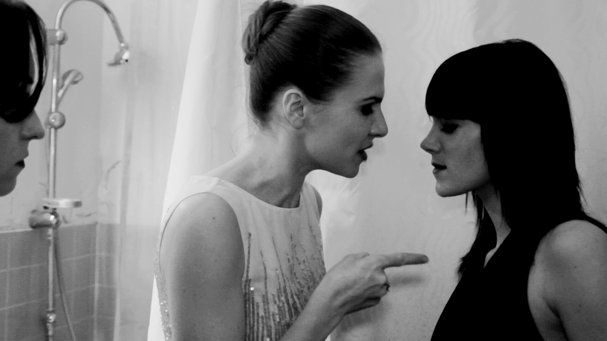

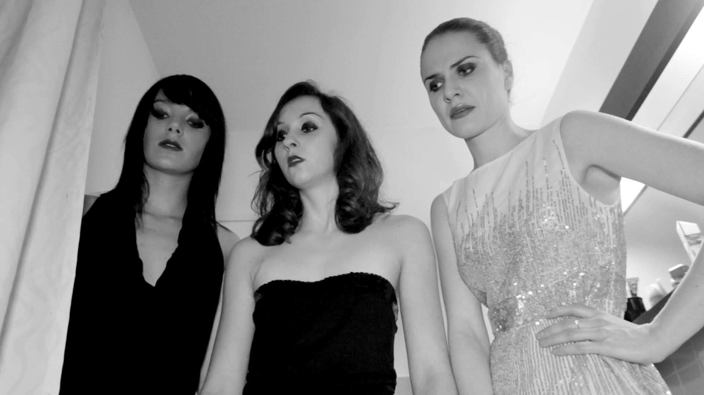

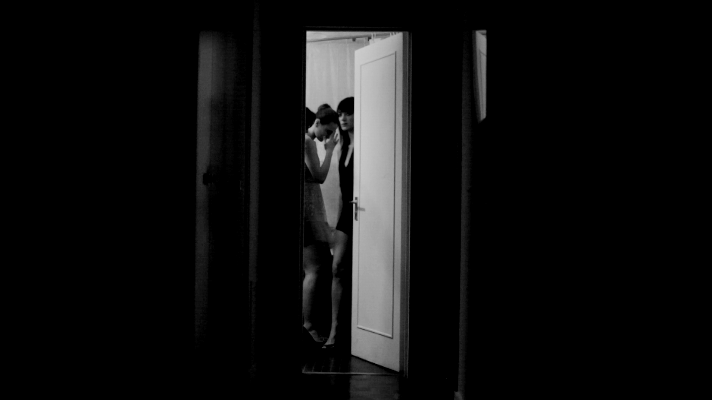
