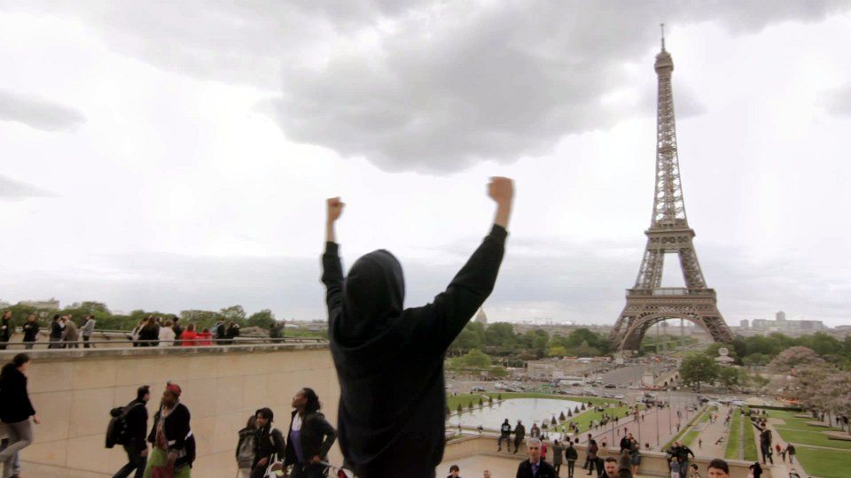

The last music video I worked on these past few months was just released. Here is [Where is she?](https://omashay.com/compositions/sounds/where-is-she-song/) an original song from [Omashay](https://omashay.com), the side-project of [Cool Cavemen's saxophonist](https://coolcavemen.com/biography/tomasito/):

https://www.youtube.com/watch?v=YjE_uIRVnv8

