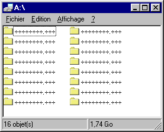
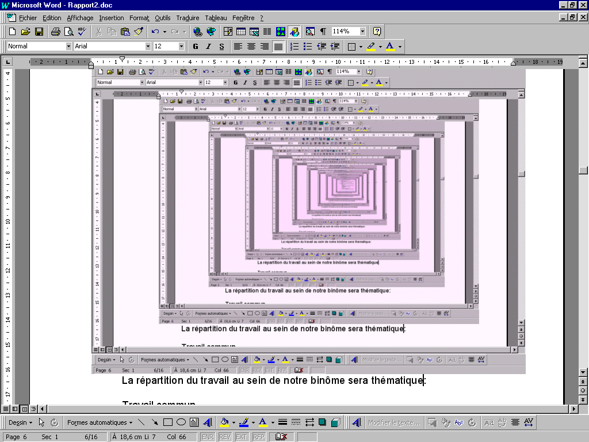
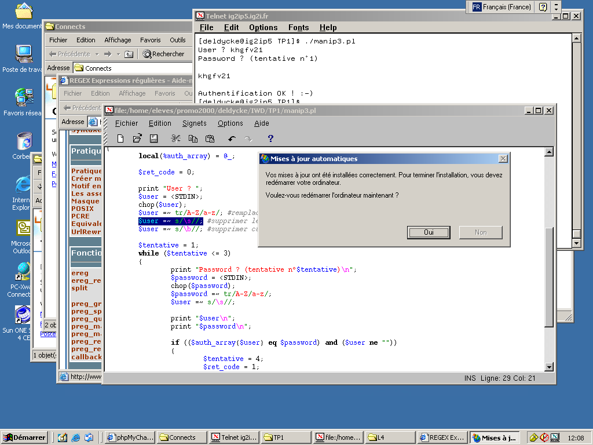
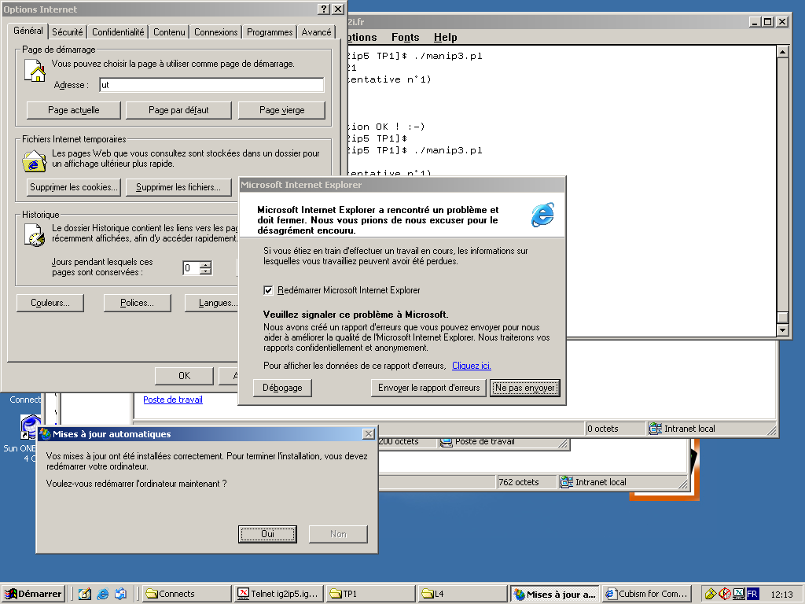

Using the holidays to tidy up my archives, I stumble upon old screenshots of Windows glitches I encountered when I was a student. Yes, the base platform at school was Windows, but it was 10 years ago (if this can constitute a valid excuse to not use Linux). Wait. What? 10 years ago? How time flies!

Anyway. Without further ado, let's start this moment of pure nostalgia with a 1.74 Gb floppy disk:

This one was produced by repeatedly screenshoting the current screen in a Word document. I found it interesting because of the decaying pink color. I think this degradation was the result of cumulative color dithering or any other image compression artifact:

The last ones are not glitches _per se_ but major UI issues. Here automated system upgrades triggered a modal window you weren't able to close or dismiss, leaving you with no choice but reboot the machine and lose any unsaved work:

