Back from holidays, and it's time for me to clear my backlog of draft articles. Here is the last and missing piece of my 2012 production notes series.

Let's rewind to year ago, when [*Where is she?* was released]({filename}/2012/where-is-she-music-video-released.md):

https://www.youtube.com/watch?v=YjE_uIRVnv8

## Pre-production

Tomasito planned this video and most of its shots in advance. Here is the basic outline of the scenes we arranged during a brainstorming session at my apartment in the end of 2010:

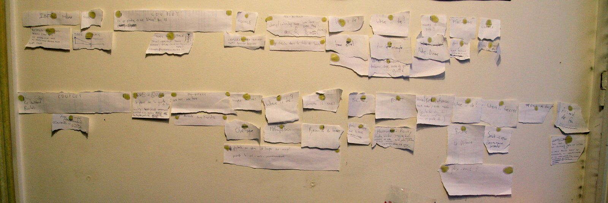

We postponed the shooting so many times that these sticky papers were hanging on my wall for 2 years.

Eventually this analog timeline led to some sketches and spreadsheets to prepare our shooting:

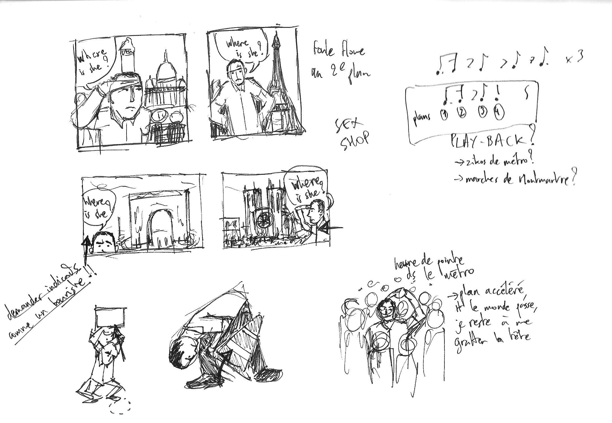

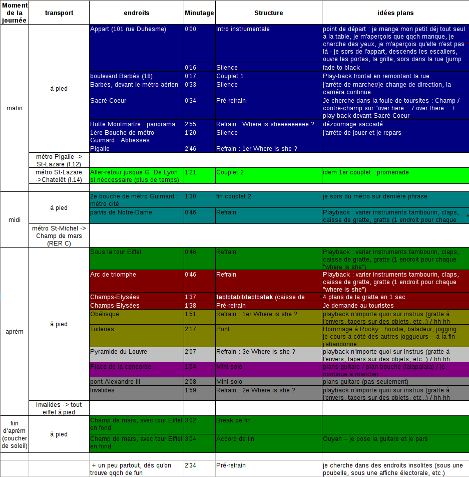

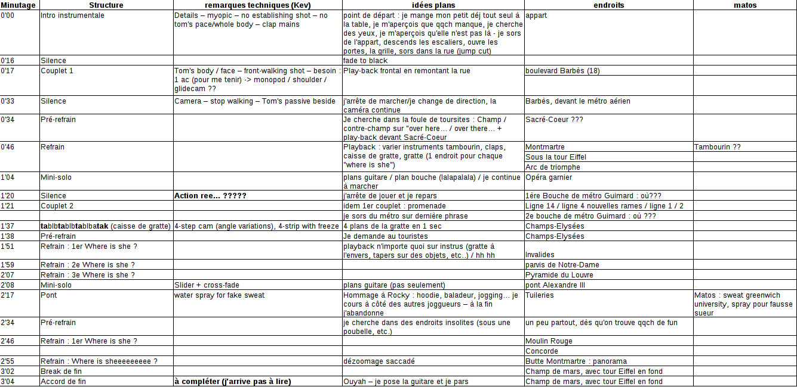

## Shooting

The following gear was involved in the making of this video:

- Canon EOS 7D
- Canon EOS 600D (Rebel T3i / Kiss X5)
- Canon EF 70-200mm f/2.8L IS II USM
- Sigma 30mm f/1.4 EX DC HSM
- Tokina 11-16mm f/2.8
- Tamron SP AF 17-50mm f/2.8 XR Di-II VC LD IF lens
- Canon EF-S 18-55mm f/3.5-5.6 IS II
- Manfrotto 055XPROB Pro Tripod Legs
- Manfrotto 701HDV Pro Fluid Video Mini Head
- Glidecam HD-2000
- a basic Canon Monopod 100
- LCD ViewFinder

I shot the video in 2012 in two days (1 & 18 May) with some help from Robin (who makes a cameo appearance as the upset tourist). Here is the **behind the scenes video**:

https://www.youtube.com/watch?v=xtLz6jfSp-I

And some extra photos of the shooting:

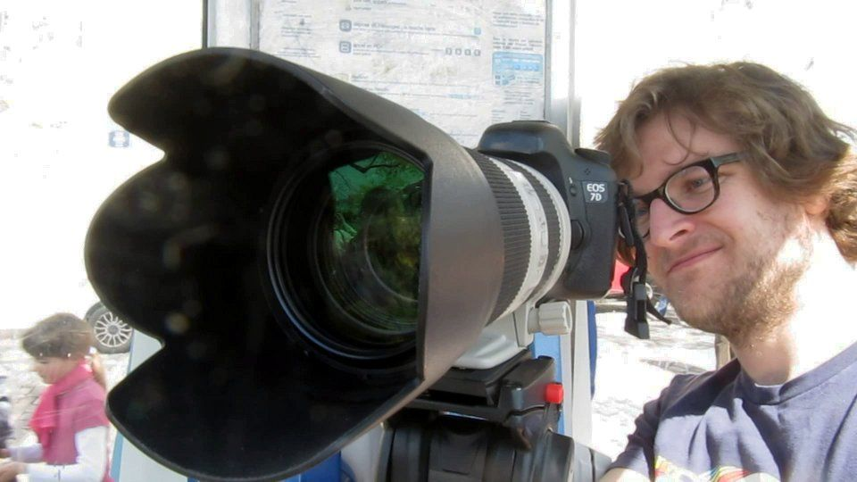

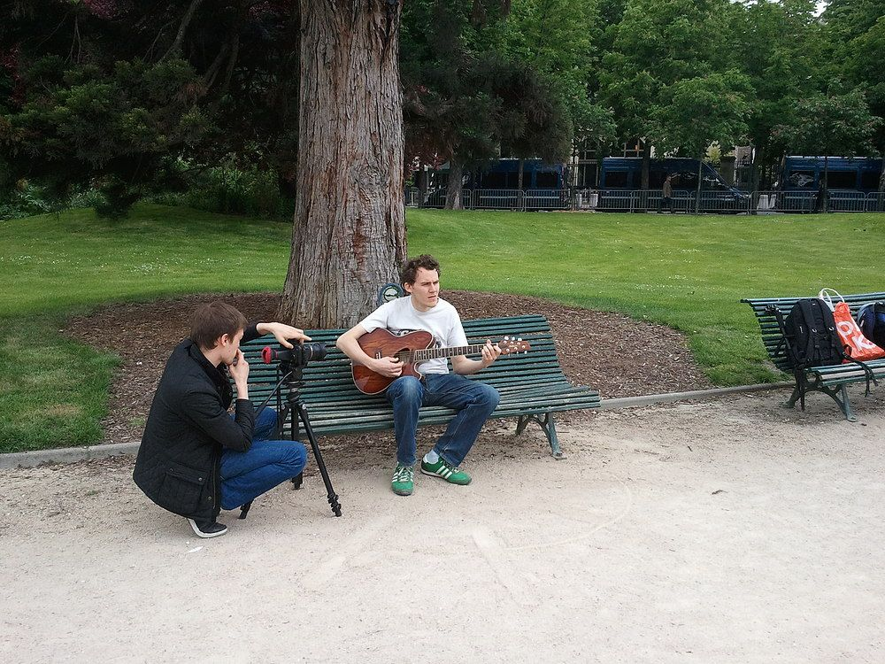

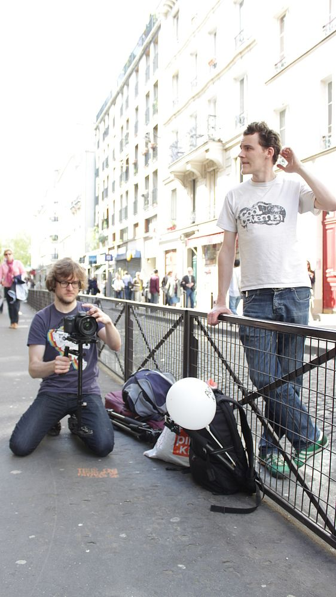

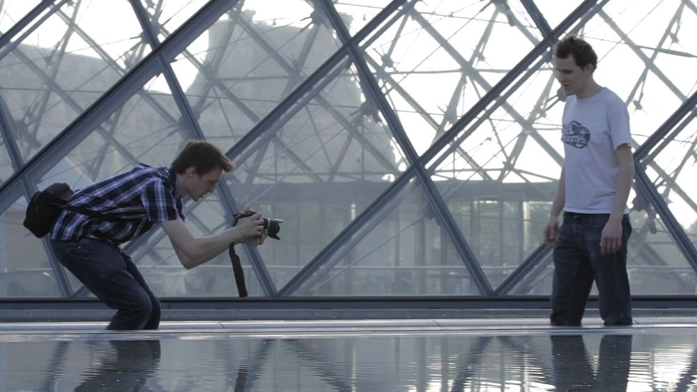

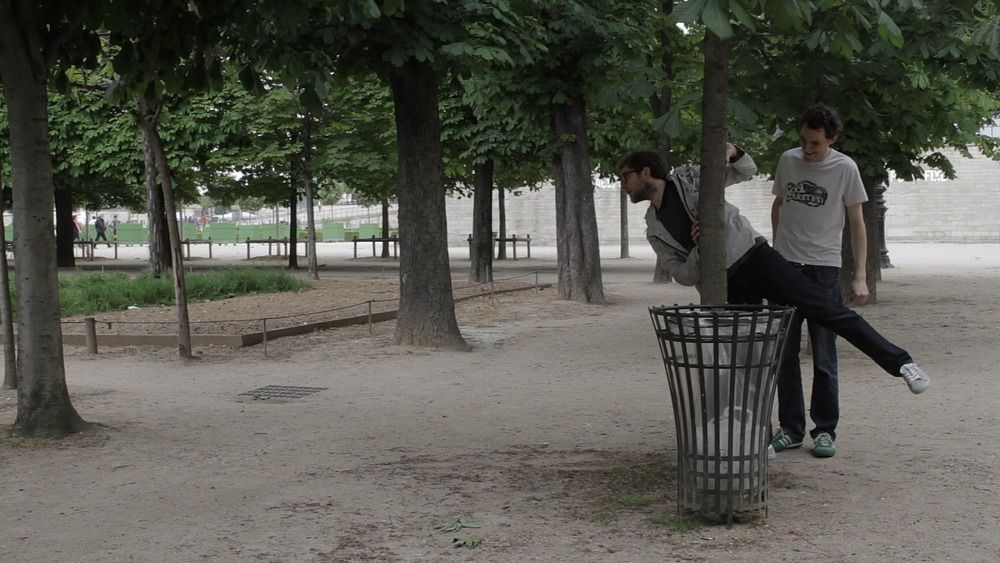

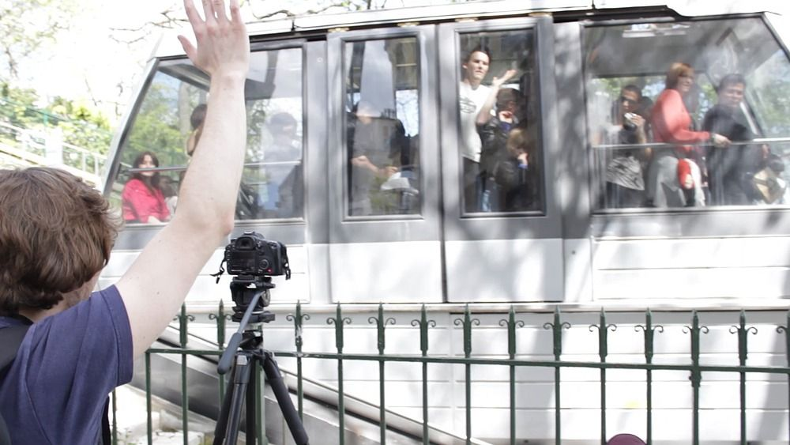

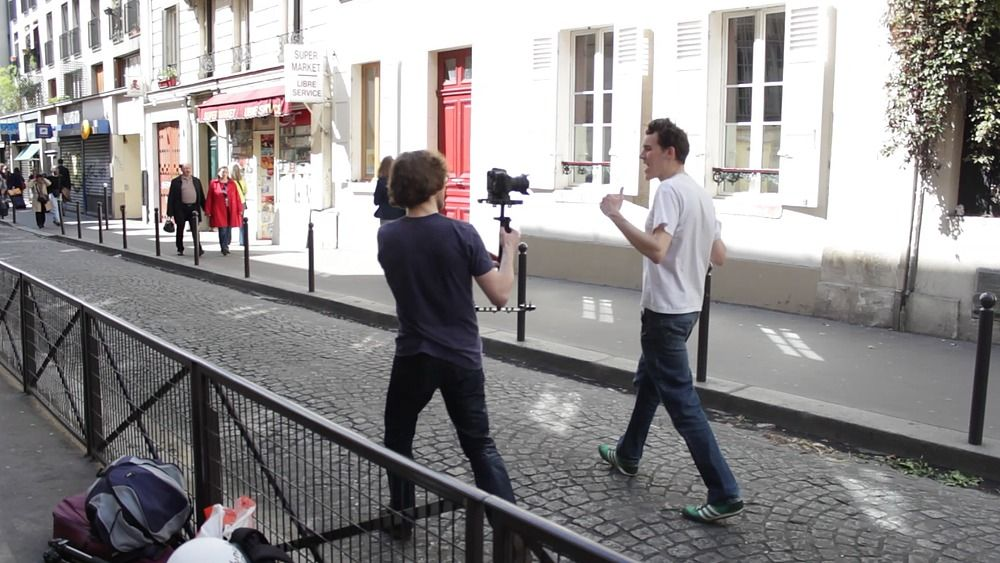

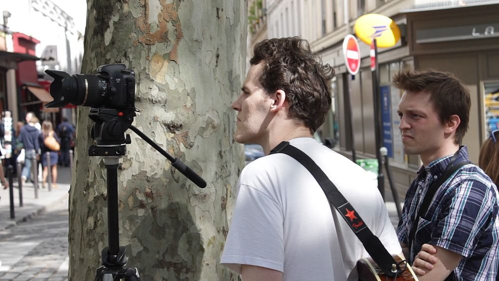

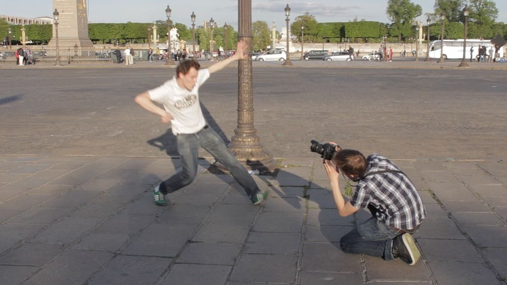

The [wedding entrance]({filename}/2012/wedding-entrance-paris-video-postcard.md) video was the first time I used my Glidecam HD-2000. But *Where is she?* was the [first publicly released video]({filename}/2012/where-is-she-music-video-released.md) featuring my new toy. And while filming with it in Montmartre, a police patrol car paid us a visit:

https://www.youtube.com/watch?v=EGh-DZjIjHg

No need to say the music video was produced in guerilla style, without any warning nor permission... ;)

## Editing

Tomasito edited alone the source footage (1080p, 23.976 fps, 1/50s shutter) in Kdenlive:

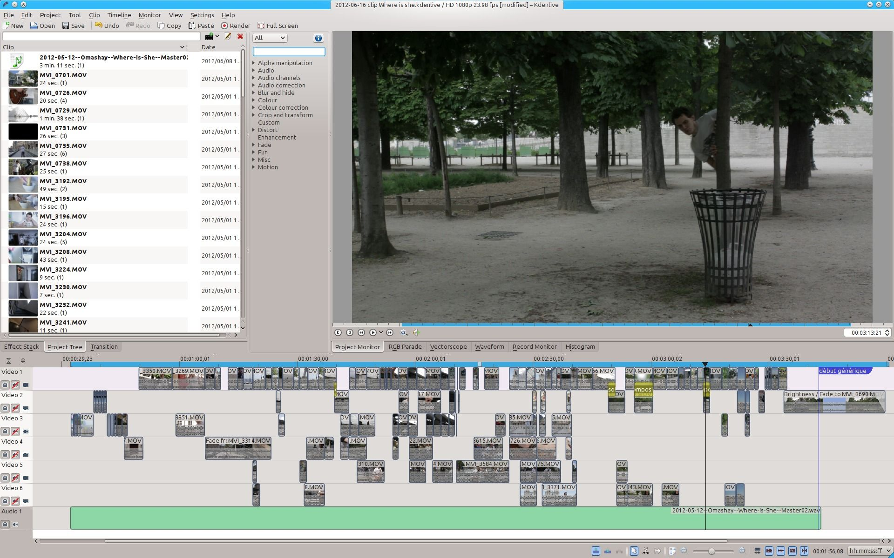

At that stage, I just helped him by creating the seamless split screens:

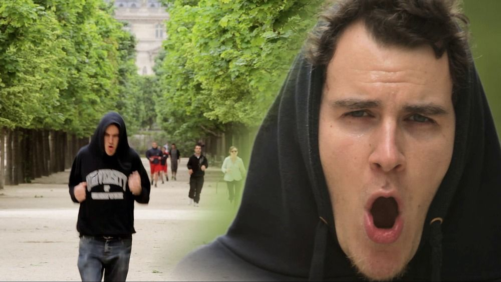

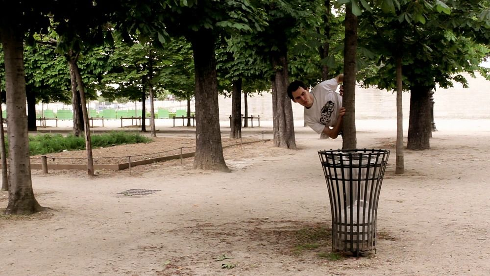

## Color correction

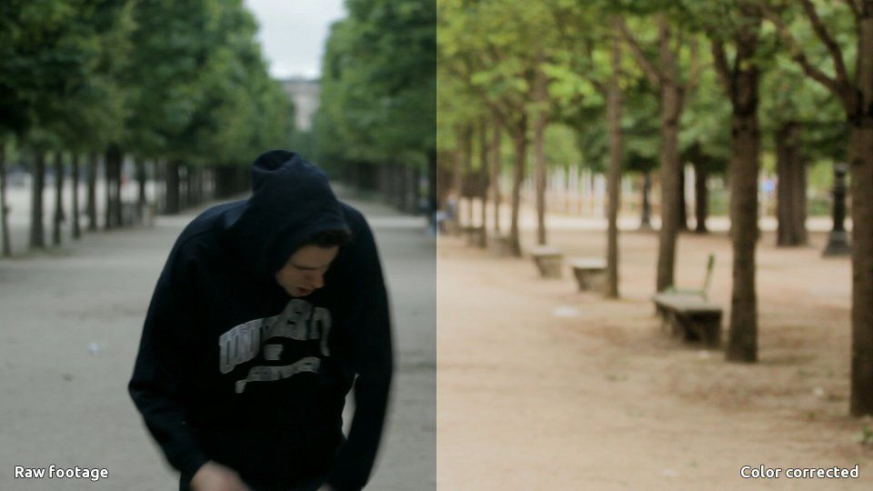

As I said in [Kdenlive's forum](https://forum.kde.org/viewtopic.php?f=266&t=112313#p270103), the color correction was a first. I never worked on a project for which any serious color correction was done. Until *Where is she?*.

I was worried by the final look of it because, [as Marko pointed out](https://forum.kde.org/viewtopic.php?f=266&t=112313#p270102) in the thread, the footage was captured in all sorts of lighting conditions. It's hard to keep a consistent exposure between all these locations, especially with the tight latitude of a Canon 7D (even with a [fine-tuned neutral color profile](https://prolost.com/flat)).

Robin did all the color correction in Kdenlive and for him, it was a first too. The goal wasn't to create a strong style. Color grading was more or less a technical mean, to keep the exposure jumping from shot to shot. Robin invested lots of time in this project and the result exceeded our expectations. The final video is fairly consistent and the cut between scenes is smooth compared to the raw footage.

I'd love to show you screenshots of the timeline with all its color parameters. Unfortunately we used an old development version, and when I try to re-open the project with the current version I have on my machine, I end up with this errors before completely crashing Kdenlive:

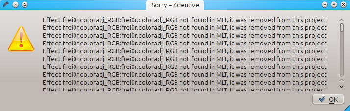

But by looking at the XML source of the project, I can assert that the whole color correction was entirely made with a combination of these 3 filters only:

- RGB adjustment (`frei0r.coloradj_RGB`)
- Curves (`frei0r.curves`)
- Brightness

If I can't show you all the details, I can still show you a comparison between the raw footage and the color correction pass (the video below has no audio on purpose):

https://www.youtube.com/watch?v=t6cCQV2Jt2U
