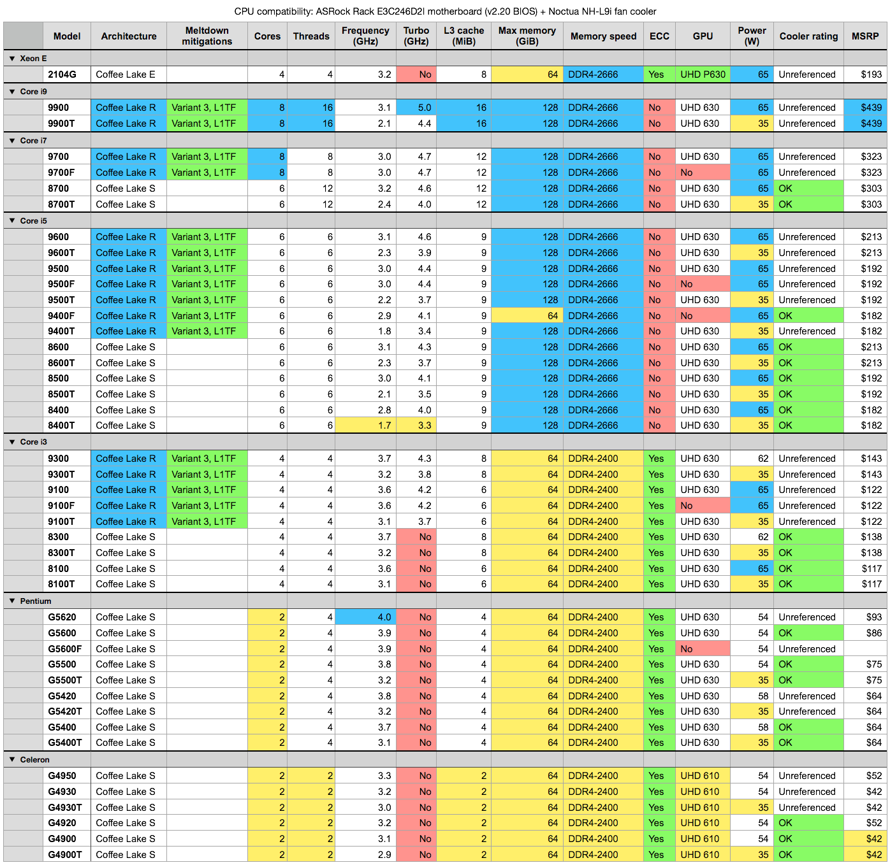

I live with a scientific data-hoarder. Last month I discovered a stash of old HDDs ranging from 320 GB to 3 TB spanning a period of 15 years. I was horrified by the high probability of loosing all that data to mechanical failure, bit-rot or shear bad luck.

I can't help it and instantly felt the urge of proper backups and data management. The first step would be the creation of a NAS at home. Best excuse to bootstrap a home-lab right? :innocent:


## Filesystem

I disqualified integrated NAS embedding their own OS and proprietary apps to avoid vendor lock-ins. I aimed for a standard and widely adopted software stack.

Silent data corruption being my main concern, I need a robust filesystems. The last time I looked years ago, BTRFS was a big upcoming contender. But it did not seemed to have caught up in popularity since then. So I **picked ZFS, for its maturity**, flexibility and native data integrity capabilities.


## OS

I need my appliance to run stable for the next few years. I can only achieve that with a healthy distribution. **Choosing FreeNAS was a no-brainer**: big community, open ecosystem, actively maintained, built upon proven technologies.

Especially since it was announced:

* [the unification of FreeNAS and TrueNAS](https://www.ixsystems.com/blog/freenas-truenas-unification/)
* [rebasing of FreeBSD code to ZFS-on-Linux](https://www.phoronix.com/scan.php?page=news_item&px=FreeBSD-ZFS-On-Linux)

This will reduce project fragmentation and a concentration of efforts: a strong future for the platform.


## Capacity

Let's evaluate my raw needs. I need a place to store:

* Copies of all external HDDs lying around the house
* Some entertainment medias
* Time Machine mount points for macOS backups

Adding all that and rounding up, I end up with at least 8 TB of immediate storage requirement. With a 20% margin, I'll be **happy with 10 TB**.


## RAID Array

To provide resiliency, flexibility and allow for future grow, we will rely on a disk array. How should we structure it?

RAID 5 or RAID-Z1 arrays (simple parity) are no longer safe. With drives getting bigger (> 2 TB), reconstructing an array takes too long. So long the probability of loosing an additional disk is real. Cascading failures is not an option.

RAID 10 is a bullet-proof arrangement. But too expensive for our home usage.

**RAID 6 / RAID-Z2 is the best compromise** by providing double parity. With 4 drives, we have a similar risk profile as RAID 10: only half the capacity is available because of redundancy, but we can loose up to two disks. The upside is that any additional drive will contribute its full capacity to the array.

Speed, space and safety of different RAID-Z types are explored in the [ZFS Raidz Performance, Capacity and Integrity](https://calomel.org/zfs_raid_speed_capacity.html) article.


## Drives

The first hardware to decide upon should be the drives. This is the core component of a NAS. Once we have these as a starting point, we can figure out the missing pieces.

### SSDs

I'm not that much interested by their performances. What I'm looking for is the peace of mind these bring data-wise, by their virtue of having no mechanical part. And the absence of noise.

**SSDs are still too expensive** for that use-case. Let's revisit that option in a couple of years as prices gets lower.

### 2.5" HDDs

That was my first choice. While pricier than their 3.5" equivalent, I was ready to pay a little premium to reduce the physical space and the noise.

Then the "[SMR scandal](https://arstechnica.com/gadgets/2020/04/caveat-emptor-smr-disks-are-being-submarined-into-unexpected-channels/)" broke out. SMR drives have bad performances and [artificially increase resilvering time of RAIDZ array from 17 hours to 10 days](https://www.servethehome.com/wd-red-smr-vs-cmr-tested-avoid-red-smr/2/#attachment_43599)!

Bad news, all **big 2.5" HDDs are SMRs**. I had to revise my plans, forget that option and switch to 3.5" drives.

Worse, I already ordered a small case ([SilverStone SST-ML05B](https://amzn.com/B07PLB3JR2/?tag=kevideld-20)) and all its accessories (fans and cables). This box was now useless as I need more volume to accommodate bulkier 3.5" drives. My plans were doomed anyway. If that case had four 2.5" slots, you can only cramp there two, maybe three, 15 mm thick drives.

> Note: SMR is not bad technology in itself. As long as the software architecture exploiting it is designed to leverage its asymmetry.

### 3.5" HDDs

The most economical option. Here are some resources to hunt down the right disk and avoid SMRs:

* [The HDD Platter Capacity Database](https://rml527.blogspot.com)
* [List of known SMR drives](https://www.ixsystems.com/community/resources/list-of-known-smr-drives.141/)

TL;DR safe bets:

* [HGST Ultrastar HE](https://amzn.com/B082J7M5ZG/?tag=kevideld-20), including shucked ones
* [Seagate IronWolf](https://amzn.com/B07H1W6214/?tag=kevideld-20) / [IronWolf Pro](https://amzn.com/B07H28PKM3/?tag=kevideld-20)
* **[Toshiba N300](https://amzn.com/B06Y2KCXCM/?tag=kevideld-20)** / [X300](https://amzn.com/B013JPLKJC/?tag=kevideld-20)

I chose the later. The [N300 series](https://www.toshiba-storage.com/products/toshiba-internal-hard-drives-n300/) has:

* Good pricing
* 3 year warranty
* 180 TB/year workload
* RV sensors
* 1M hours MTBF
* A design fit for NAS and RAID arrays usage

The purchasing decision was also driven by availability, and the fact it was the first drive announced by its manufacturer to be non-SMR following the scandal. Which shows how timing and transparency is somewhat critical to get new customers. ;)

I **went with the 6 TB models** as they were at the right $/TB sweet-spot and gave me 12 TB of useable space. Beware that these drives are loud. Only discovered too late the 6 TB model is 33 dB while the 12-16 TB variants are 20 dB (according to specs sheet).

I ordered four of them on three different marketplaces, with a couple of days in between to spread the risk of delivery mishandling. This is more superstition than science. These drives are likely to come from the same manufacturing batch given the time-window.


## Case

Went fishing for another case. I increased my budget three times and got a [SilverStone SST-DS380](https://amzn.com/B07PCH47Z2/?tag=kevideld-20):

* Plenty of room to grow with its 8 hot-swappable 3.5" front bays
* Mini-ITX motherboard format
* SFX PSU format (already ordered one)
* Fit in my electrical cabinet (extremely important)


## Motherboard

Requirements:

* Had to be x86-64 for FreeNAS
* Mini-ITX, to reduce as much the form factor
* At least 4 SATA III ports

I stumbled upon the [Gigabyte GA-J3455-D3H](https://amzn.com/B071R4P6QG/?tag=kevideld-20) which fits the bill and comes with a pretty fan-less design, thanks to its built-in [Intel Celeron J3455](https://www.cpu-monkey.com/en/cpu-intel_celeron_j3455-662) quad-core (up to 2.3 GHz).

Some reviews here and there called upon its capricious nature. To play it safe I carefully choose [RAM that was certified by the manufacturer](https://download.gigabyte.com/FileList/Memory/mb_memory_ga-j3455n-d3h.pdf), and maxed it out at 16 GB.


## Realtek NICs are Shit

I tested the setup for a couple of days and everything worked great.

But I overlooked one issue: [Realtek ethernet NICs are shit](https://www.reddit.com/r/freenas/comments/bul9gq/so_are_realtek_nics_just_complete_garbage_when_it/). It's written everywhere on discussions boards, even on [FreeNAS hardware requirements](https://www.freenas.org/hardware-requirements/) page ("Intel recommended" they said...). I ignored the warning thinking it was meant for enterprise users looking for performances.

Sure enough things went south fast the first time I tried to copy 700 GB over the network. I left the transfer unattended in the night and woke up with a NAS nowhere to be found on the LAN. The Realtek NIC just froze, bringing the whole motherboard with it.

A hard reset later, I found an infinite amount of these in the logs:

```
(...)
May 11 13:06:36 freenas kernel: re0: link state changed to DOWN
May 11 13:06:36 freenas kernel: re0: link state changed to DOWN
May 11 13:06:40 freenas kernel: re0: link state changed to UP
May 11 13:06:40 freenas kernel: re0: link state changed to UP
May 11 13:18:43 freenas re0: watchdog timeout
May 11 13:18:43 freenas kernel: re0: link state changed to DOWN
May 11 13:18:43 freenas kernel: re0: link state changed to DOWN
May 11 13:18:47 freenas kernel: re0: link state changed to UP
May 11 13:18:47 freenas kernel: re0: link state changed to UP
May 11 13:25:17 freenas re0: watchdog timeout
May 11 13:25:17 freenas kernel: re0: link state changed to DOWN
May 11 13:25:17 freenas kernel: re0: link state changed to DOWN
May 11 13:25:21 freenas kernel: re0: link state changed to UP
May 11 13:25:21 freenas kernel: re0: link state changed to UP
May 11 13:28:46 freenas kernel: re0: link state changed to DOWN
May 11 13:28:46 freenas kernel: re0: link state changed to DOWN
May 11 13:28:49 freenas kernel: re1: link state changed to UP
May 11 13:28:49 freenas kernel: re1: link state changed to UP
(...)
```

I already wasted too much time with hardware. I decided to just throw money at the problem and get a server-grade motherboard.

Meanwhile, I resorted to one of the worst hack I ever came up with. Not sure it will even have an effect. I added a cronjob-based watchdog checking connectivity and rebooting the machine if the local router can't be found:

```shell-session
$ ping -c 15 -o -t 600 192.168.0.254 || shutdown -r now
```


## Motherboard, take #2

So I settled on an [ASRock Rack E3C246D2I](https://amzn.com/B07SNPXBN1/?tag=kevideld-20):

* Intel NICs, finally!
* 8 total SATA by the way of additional OCuLink port
* ECC memory
* PCIe 3.0 x16
* 3 PWM fan (CPU + front + rear) and thermal sensor header for finer (read quieter) cooling
* Dedicated IPMI/BMC LAN ethernet socket, with non-JAVA UI
* All USB 3.1 ports are Gen2, not Gen1, so no time wasted worrying on which is which
* No unnecessary multimedia ports (no audio, no Display port, no HDMI)


## CPU and Cooling

I went for the lowest TDP and cheapest CPU, and got a second-hand [Intel Celeron G4900T](https://www.cpu-monkey.com/en/cpu-intel_celeron_g4900t-860):

* 2.9 GHz
* 2 cores (2 threads)
* 2 MB L3 cache
* 35 Watts TDP
* Up to 64 GB ECC DDR4-2400 RAM

We're no longer fan-less, so I searched for the most silent cooling I could ever found. I stumble upon the [Noctua NH-L9i chromax.black](https://amzn.com/B07Y892M38/?tag=kevideld-20) for LGA 1151 sockets CPUs. Which also perfectly fit the low-profile requirement of my case (< 57 mm).


## Bill of Materials

Initial plans:

| Part | Model | Quantity | Total (excl. shipping) | Notes |
|---|---|---:|---:|---|
| 2.5" HDD | [Seagate BarraCuda Mobile - 4 TB](https://amzn.com/B01LZMUNGR/?tag=kevideld-20) | 4 | €759.76 | Abandonned because of SMR. |
| Small case | [SilverStone SST-ML05B](https://amzn.com/B07PLB3JR2/?tag=kevideld-20) | 1 | €52.84 | Refunded: not enough 3.5" slots. |
| Fans for case | [Noctua NF-A8 PWM](https://amzn.com/B00NEMG62M/?tag=kevideld-20), 4 pins, 80 mm | 2 | €31.80 | Refunded: only fit the case above. |
| Mini-ITX motherboard | [Gigabyte GA-J3455-D3H](https://amzn.com/B071R4P6QG/?tag=kevideld-20) | 1 | €98.54 | Refunded because of Realtek NICs. |
| RAM | [Corsair CMSO16GX3M2C1600C11](https://amzn.com/B00EH1H86C/?tag=kevideld-20) 16GB (2x8GB) DDR3 SODIMM 1600 MHz | 1 | €75.76 | Refunded: only fit for motherboard above. |
| Power supply | [Corsair SF450](https://amzn.com/B07XJ5GL8Y/?tag=kevideld-20), modular, 450 W, 80+ Platinum | 1 | €119.90 | Reused. |
| Flash drive | [SanDisk Ultra Fit 16 GB](https://amzn.com/B077Y149DL/?tag=kevideld-20), USB 3.1 | 1 | €9.59 | Reused. |
| SATA cable | [SATA 3 - 90° plugs](https://amzn.com/B07QYWFKL4/?tag=kevideld-20) | 6 | €15.56 | Refunded: 90° plugs not fit for newer case. | 
| | | **Total** | **€1163.75** |  |

And my final configuration:

| Part | Model | Quantity | Total (excl. shipping) | Shipping | Notes |
|---|---|---:|---:|---:|---|
| 3.5" HDD | [Toshiba N300 - 6 GB](https://amzn.com/B06Y2KCXCM/?tag=kevideld-20) | 4 | €696.89 | €12.84 | Unit price: €168.30~€184.88 |
| Bigger case | [SilverStone SST-DS380](https://amzn.com/B07PCH47Z2/?tag=kevideld-20) | 1 | €145.18 | €17.50 |
| Mini-ITX motherboard | [ASRock Rack E3C246D2I](https://amzn.com/B07SNPXBN1/?tag=kevideld-20) | 1 | €324.84 | €21.05 |
| CPU | [Intel Celeron G4900T](https://www.cpu-monkey.com/en/cpu-intel_celeron_g4900t-860) Coffee Lake-S, 2 cores, 2.9GHz | 1 | €58.00 | €12.90 | 
| CPU cooler | [Noctua NH-L9i chromax.black](https://amzn.com/B07Y892M38/?tag=kevideld-20) | 1 | €49.90 | €0.99 | Shipped with thermal paste.
| RAM | [Kingston KSM26ES8/8ME](https://amzn.com/B07BGB6TYS/?tag=kevideld-20) 8GB 2666MHz DDR4 ECC CL19 | 2 | €137.76 | |
| Power supply | [Corsair SF450](https://amzn.com/B07XJ5GL8Y/?tag=kevideld-20), modular, 450 W, 80+ Platinum | 1 | €119.90 | |
| Flash drive | [SanDisk Ultra Fit 16 GB](https://amzn.com/B077Y149DL/?tag=kevideld-20), USB 3.1 | 1 | €9.59 | |
| SATA cable | [SATA 3 - straight plug](https://amzn.com/B018Y2LCEI/?tag=kevideld-20) | 3 | €6.99 | | 
| OCuLink cable | [Supermicro CBL-SAST-0933](https://store.supermicro.com/supermicro-50cm-oculink-to-4-sata-cable-cbl-sast-0933.html) OCuLink to 4 SATA | 1 | €29.76 | €12.01 | 
| | | **Total** | **€1578.81** | €77.29 | |

Switching from 2.5" to 3.5" increased the budget by 35%, but I got:

* 50% more useable space (8TB → 12 TB)
* 100% more SATA slots (4 → 8)
* Practical front-loading bays for up to 8 disks
* ECC RAM
* Intel NICs
* Faster disks (5400 rpm → 7200 rpm)
* A more powerful CPU (half the cores, but faster)

My attempt at a 2.5" disk home NAS was expensive. The TCO of the whole project is way too high if you add the frustration, fallbacks, and time spend browsing forums, gathering reviews, returning and getting refunds. All because of bad purchase decisions and poor planning.

From an economical point of view, a NAS at home is a stupid project. I should have just pushed all data to a bucket in either AWS, GCP or Azure and call it a day. So why bother? Let's say this is a personal reminder of the incentives and economics of running a cloud business.


## Upgrade Path

This time we'll try to plan ahead future hardware purchase.

### Storage

Need more space? We have a couple of options:

1. **Buy new 6 TB drives** to expand the RAIDZ array. Plain and simple. The NAS has been designed this way. Use it. The current motherboard support up to 8 SATA drives, thanks to our pre-purchased OCuLink cable. And the case already has 4 free 3.5" bays.

1. An alternative consist in upgrading the base capacity of each disk. Just **purchase 4 new identical drive, all bigger than 6 TB**. Swap from the active array one, and one only, old disk with a brand new, bigger disk. Resilver. Repeat 4 times. Then grow the ZFS vdev. You can now sell the old 6 TB drives. This solution might be more future-proof depending on the $/TB sweet-spot and age of the 6TB disk.

### Drives

* Revisit the 2.5" form-factor. Mobile non-SMR HDDs might get bigger but that's unlikely. The industry is kind of stuck with current technology and the way forward is SSDs. 

* So **keep watching the $/TB economics of SSDs**. In a couple of years, if prices gets reasonable for a home NAS setup, it might be time to get rid of spinning rust.

### CPU

I don't need more CPU power yet. Unless I'll get to run a couple of virtual machines on the NAS. In this section I'll cross-reference [CPUs supported by the motherboard](https://www.asrockrack.com/general/productdetail.asp?Model=E3C246D2I#CPU) with [cooler compatibility](https://noctua.at/en/products/cpu-cooler-retail/nh-l9i/cpucomp#manuf_8346).

All CPUs featured in the resulting matrix below shares these specs:

* Intel x86-64, 3rd generation enhanced 14nm++ process
* Socket LGA-1151
* [TDP <= 65 W to keep cooler within limits](https://www.amazon.com/gp/customer-reviews/R20G4BY1K6F88C/ref=cm_cr_dp_d_rvw_ttl?ie=UTF8&ASIN=B009VCAJ7W
)
* SMM, FPU, NX, MMX, SSE, SSE2, SSE3, SSSE3, SSE4.1, SSE4.2, AES (encryption boost), AVX, FMA3, and AVX2
* VT-x, VT-d
* Dual-channel memory



Source: [`cpu-compatibility-asrock-e3c246d2i-noctua-nh-l9i.numbers`](../uploads/2020/cpu-compatibility-asrock-e3c246d2i-noctua-nh-l9i.numbers)

Most Coffee Lake R CPUs are missing from Noctua list (tagged as `unreferenced`). I have no intention of overlocking. We can still assume they're safe for our cooler, based on TDP and filiation to their Coffee Lake S ancestors.

Low power 35 W models (T suffix) are safe choice.

The no-suffix and F variants are great, and their TDP are perfectly in range with the cooler capabilities. If we find out 65 W to be too much, we can still artificially put a hard-limit to the CPU in BIOS.

As this upgrade is targetting VM usages, I'll skip the F-variant altogether. [GPU passthrough is still highly experimental in FreeBSD's Bhyve hypervisor](https://www.phoronix.com/scan.php?page=news_item&px=Bhyve-GPU-Passthrough-2019). But there's still [some hope](https://www.reddit.com/r/freebsd/comments/encul2/steam_os_in_bhyve_with_gpu_passthroughguidance/) to have the UHD 630 iGPU supported in the far future, and provide accelerated video encoding and decoding to VMs.

My final shortlist is:

1. **[Core i3-9300](https://www.servethehome.com/intel-core-i3-9300-benchmarks-and-review/)** to max out cache and frequency
1. **Core i3-9300T** same as above with lower frequency but safe thermals
1. **Core i3-9100** or **i3-9100T** as a choice of last resort, the two above getting harder and harder to find in retail as time goes (Intel prioritizing higher SKUs to increase margins)


This will bring:

* Newer Coffee Lake R architecture with some in-silicon Meldown mitigations
* Twice the cores (2 → 4)
* 6-27% more speed (2.9 GHz → 3.1-3.7 GHz)
* 3.7-4.3 GHz turbo boost ability (27-48% faster)
* 3-4x L3 cache
* Keep ECC capabilities

> Note: there's an elusive candidate in the name of the [Core i3-9320, based on the i3-9300](https://www.cpu-monkey.com/en/compare_cpu-intel_core_i3_9300-922-vs-intel_core_i3_9320-921), with slightly better turbo. Unfortunately it is not referenced in the motherboard compatibility list.

### RAM

If the motherboard support DDR4-2666, the table above revealed CPUs supporting that speed have no ECC support. It's pointless to pursue faster RAM and sacrifice data integrity. We'll **keep at 2400 MHz, and purchase DDR4-2666 if cheaper**.

The current 16 GB are plenty, even with 8 drives in the RAIDZ array. To support VMs, 32 GB will be nice to have. Maxing it out to 64 GB is a luxury. The upgrade will depends of price.

### Motherboard

The one I ended up with is good enough for the years to come. I can only see a motherboard upgrade triggered by a change in drive interfaces. Once SSDs will makes sense, I'll probably have to upgrade from SATA to an array of M.2, MVNe or whatever the right standard will be for these drives in the future.

At which point these extra-features might be nice-to-have:

* Integrated 10G NICs (latest model being [Intel X710 controller, supported by FreeBSD](https://ark.intel.com/content/www/us/en/ark/products/189534/intel-ethernet-controller-x710-at2.html))
* A complete fan-less design
* Wait for Zen 3
